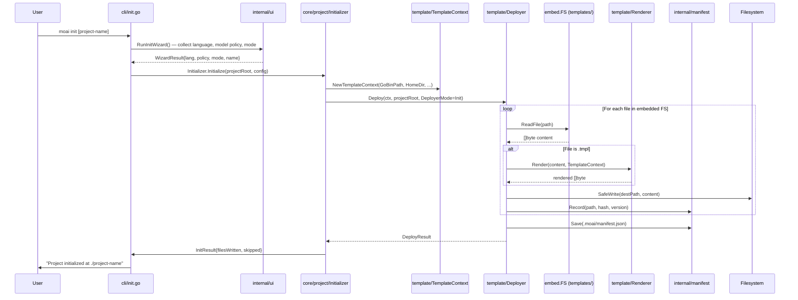
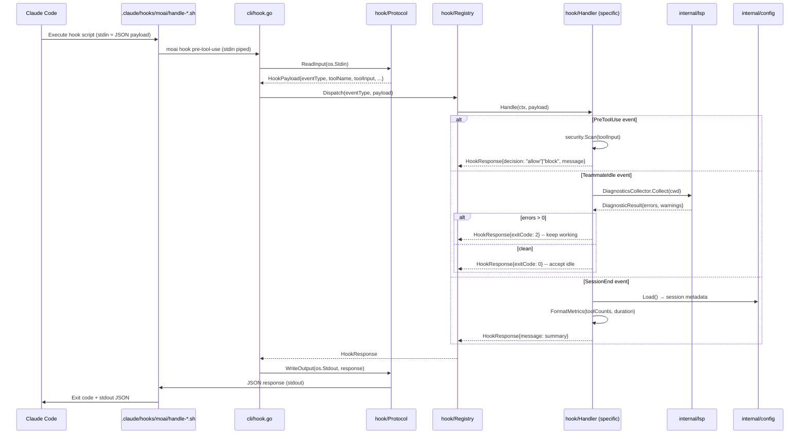
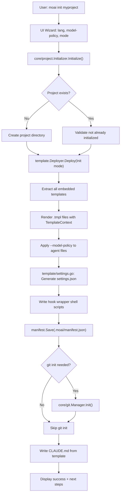
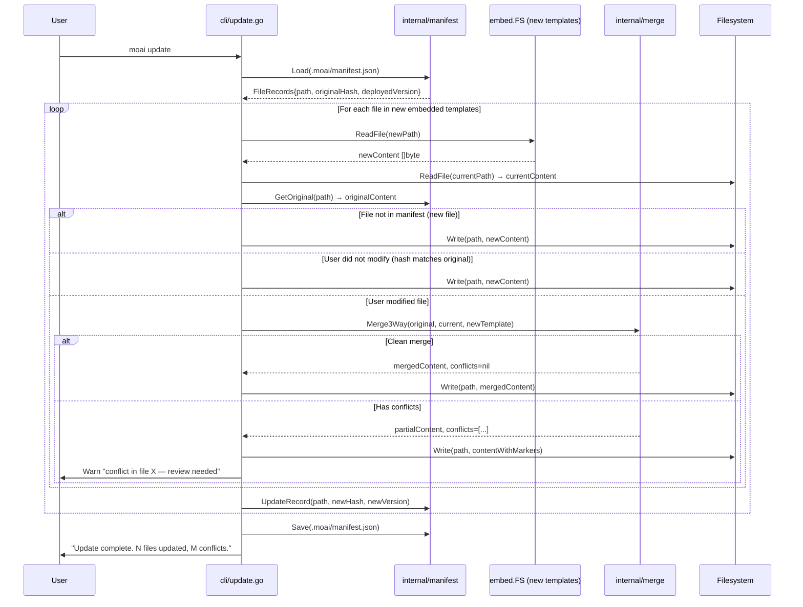
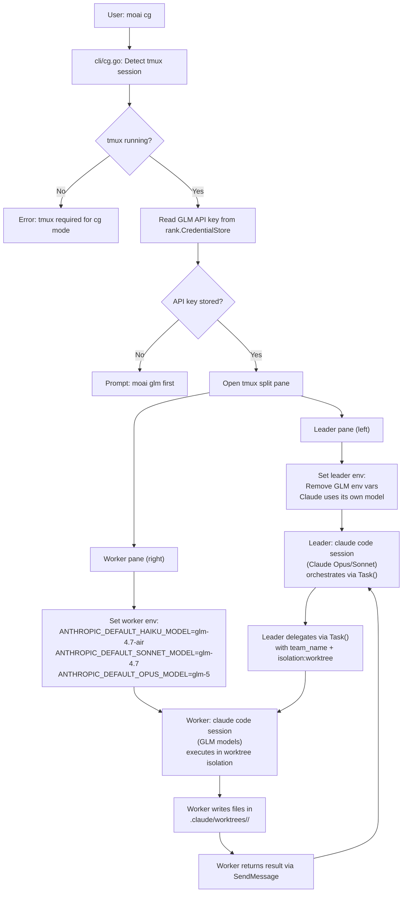
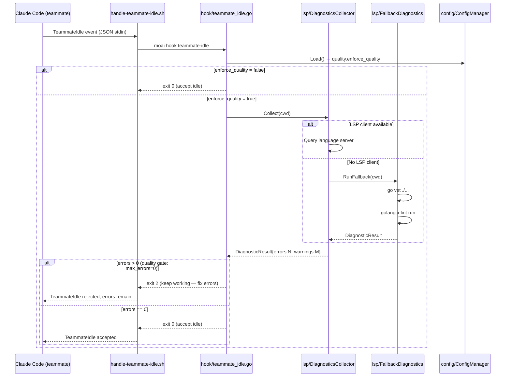

# Data Flow

Key data paths through moai-adk-go for the five most important operations.

---

## 1. Template Deployment Flow (`moai init`)

The primary purpose of `moai init` is to extract embedded templates into a new project directory, render Go text/template variables, and write all configuration files.



**Key data transformations:**

| Stage | Input | Output |
|-------|-------|--------|
| Wizard | User prompts | `WizardResult` struct |
| TemplateContext | OS env vars, Go paths | `TemplateContext{GoBinPath, HomeDir}` |
| Renderer | `.tmpl` file bytes + context | Rendered file bytes (variables substituted) |
| ModelPolicy | Agent `.md` files + policy level | Modified `model:` frontmatter fields |
| Manifest | File paths + content hashes | `.moai/manifest.json` (deploy record) |

---

## 2. Hook Execution Flow (`moai hook <event>`)

Claude Code invokes `moai hook <event>` via shell wrappers whenever a hook event fires. The process reads JSON from stdin, dispatches to handlers, and writes a JSON response to stdout.



**Hook response exit codes:**

| Exit Code | Meaning | Events That Use It |
|-----------|---------|-------------------|
| `0` | Success / allow | All events |
| `1` | Error / deny | `PreToolUse`, `PermissionRequest` |
| `2` | Special signal | `TeammateIdle` (keep working), `TaskCompleted` (reject), `PermissionRequest` (auto-approve) |

---

## 3. Project Initialization Flow (Full `moai init` with Git)

This shows the broader initialization beyond template deployment, including Git setup and settings generation.



---

## 4. Template Update Flow (`moai update`)

`moai update` must safely merge new template versions with user modifications. It uses 3-way merge to preserve customizations.



---

## 5. Multi-Model (GLM/CG) Mode Flow

The `moai cg` command enables a hybrid execution model where Claude Code acts as the orchestrator (leader) and GLM-powered sessions act as workers in isolated git worktrees.



### Data Flow: `moai glm` (Settings Manipulation)

```
User: moai glm sk-xxxx
  → cli/glm.go
    → Read ~/.claude/settings.json
    → rank.CredentialStore.Save("glm-api-key", "sk-xxxx")
    → Patch settings.json env section:
        ANTHROPIC_DEFAULT_HAIKU_MODEL  = "glm-4.7-air"
        ANTHROPIC_DEFAULT_SONNET_MODEL = "glm-4.7"
        ANTHROPIC_DEFAULT_OPUS_MODEL   = "glm-5"
    → Write ~/.claude/settings.json
    → Print confirmation
```

### Data Flow: `moai cc` (Revert to Claude)

```
User: moai cc
  → cli/cc.go
    → Read ~/.claude/settings.json
    → Remove ANTHROPIC_DEFAULT_*_MODEL entries from env section
    → Write ~/.claude/settings.json
    → Print "Claude-only mode active"
```

---

## 6. LSP Quality Gate Flow (TeammateIdle Hook)

This is the quality enforcement mechanism that prevents teammates from going idle while LSP errors exist.



**Quality gate thresholds** (from `.moai/config/sections/quality.yaml`):

| Phase | `max_errors` | `max_type_errors` | `max_lint_errors` | Action on violation |
|-------|-------------|-------------------|-------------------|---------------------|
| `run` | 0 | 0 | 0 | TeammateIdle → exit 2 |
| `sync` | 0 | — | — | TeammateIdle → exit 2 |

---

## Data Structure: Hook Payload

All hook events share a common JSON envelope read from stdin:

```
{
  "event":     "TeammateIdle" | "PreToolUse" | "SessionStart" | ...,
  "sessionId": "uuid",
  "toolName":  "Bash" | "Write" | "Read" | ...,   // PreToolUse only
  "toolInput": { ... },                              // PreToolUse only
  "cwd":       "/path/to/project",
  "hookId":    "uuid",
  "timestamp": "ISO8601"
}
```

Response written to stdout:

```
{
  "decision":  "allow" | "block",   // PreToolUse / PermissionRequest
  "message":   "human-readable",
  "reason":    "machine-readable"
}
```

Exit code carries the primary signal; stdout JSON provides human-readable context.
