# Dependency Graph

Internal and external dependency analysis for moai-adk-go.

---

## Dependency Direction Principles

1. **Strictly acyclic**: No circular imports exist. Go's compiler enforces this at build time.
2. **Downward only**: Higher layers import lower layers; lower layers never import higher layers.
3. **Interface at boundaries**: Packages export interfaces, not concrete types, at layer boundaries.
4. **`pkg/` is universally accessible**: Both `internal/` packages and potential external consumers may import `pkg/`.
5. **`internal/defs/` and `internal/foundation/` are leaves**: They import nothing from the project — only the standard library.

---

## Internal Dependency Graph

```mermaid
flowchart TD
    MAIN["cmd/moai/main.go"]

    subgraph cli_layer["CLI Layer"]
        CLI["internal/cli"]
        WT["internal/cli/worktree"]
    end

    subgraph interface_layer["Interface Layer"]
        HOOK["internal/hook"]
        CONFIG["internal/config"]
        TMUX["internal/tmux"]
        HOOKSEC["internal/hook/security"]
        LSPHOOK["internal/lsp/hook"]
    end

    subgraph domain_layer["Domain Layer"]
        PROJ["internal/core/project"]
        CGIT["internal/core/git"]
        QUAL["internal/core/quality"]
        TMPL["internal/template"]
        WORKFLOW["internal/workflow"]
        LOOP["internal/loop"]
        MERGE["internal/merge"]
    end

    subgraph infra_layer["Infrastructure Layer"]
        LSP["internal/lsp"]
        GITHUB["internal/github"]
        RANK["internal/rank"]
        UPDATE["internal/update"]
        SHELL["internal/shell"]
        STATUS["internal/statusline"]
        RESIL["internal/resilience"]
    end

    subgraph support_layer["Support Layer (Leaves)"]
        FOUND["internal/foundation"]
        DEFS["internal/defs"]
        I18N["internal/i18n"]
        MANIFEST["internal/manifest"]
        ASTGREP["internal/astgrep"]
        RALPH["internal/ralph"]
        GIT["internal/git"]
    end

    subgraph pkg_layer["Public API"]
        MODELS["pkg/models"]
        VER["pkg/version"]
    end

    MAIN --> CLI

    CLI --> HOOK
    CLI --> CONFIG
    CLI --> TMUX
    CLI --> PROJ
    CLI --> CGIT
    CLI --> TMPL
    CLI --> UPDATE
    CLI --> RANK
    CLI --> GITHUB
    CLI --> STATUS
    CLI --> WORKFLOW
    CLI --> LOOP
    CLI --> FOUND
    CLI --> DEFS
    CLI --> I18N
    CLI --> VER
    WT --> CGIT

    HOOK --> CONFIG
    HOOK --> RANK
    HOOK --> HOOKSEC
    HOOK --> LSPHOOK
    HOOK --> DEFS

    HOOKSEC --> ASTGREP
    LSPHOOK --> LSP

    PROJ --> CGIT
    PROJ --> SHELL
    PROJ --> TMPL
    PROJ --> MERGE
    PROJ --> MANIFEST
    PROJ --> QUAL
    PROJ --> FOUND

    LOOP --> LSP
    LOOP --> RESIL
    LOOP --> FOUND

    CONFIG --> MODELS
    TMPL --> MODELS
    TMPL --> MANIFEST
    TMPL --> FOUND

    LSP --> RESIL
    UPDATE --> RESIL
    RANK --> RESIL
    GITHUB --> RESIL

    STATUS --> SHELL
    STATUS --> WORKFLOW

    QUAL --> LSP
    QUAL --> RALPH

    GIT --> FOUND
    CGIT --> GIT
    CGIT --> FOUND
```



---

## Key Dependency Paths

### Composition Root to Domain Services

```
cmd/moai/main.go
  → cli.Execute()
    → cli.InitDependencies() [deps.go]
      → config.NewConfigManager()
      → core/git.NewManager()          (Repository + BranchManager + WorktreeManager)
      → hook.NewRegistry(config)
        → hook.NewSessionStartHandler(config)
        → hook.NewSessionEndHandler()
        → hook.NewPreToolHandler(security.NewSecurityScanner())
        → hook.NewPostToolHandler(lsp.NewDiagnosticsCollector(...))
        → hook.NewTeammateIdleHandler(lsp.NewDiagnosticsCollector(...))
        → hook.NewTaskCompletedHandler(...)
        → hook.NewWorktreeCreateHandler()
        → hook.NewWorktreeRemoveHandler()
        → [9 more handlers...]
      → update.NewChecker()
      → update.NewOrchestrator()
      → rank.NewFileCredentialStore()
```

### Template Deployment Path

```
cli.init (moai init)
  → core/project.Initializer.Initialize()
    → template.Deployer.Deploy(TemplateContext, projectRoot, mode)
      → template.embed.FS (//go:embed templates)
      → template.Renderer.Render(file, TemplateContext)
      → manifest.Save(fileRecords)
      → foundation.SafeWrite(path, content)
```

### Hook Event Path

```
moai hook <event> [flags]
  → cli.hook.RunE()
    → hook.Registry.Dispatch(eventType, stdin)
      → hook.Protocol.ReadInput(stdin) → JSON payload
      → handler.Handle(ctx, payload)
        → [handler-specific logic]
        → hook.Protocol.WriteOutput(stdout, response)
```

---

## External Dependencies

### Direct Dependencies

| Package | Version | Purpose | Layer Used By |
|---------|---------|---------|---------------|
| `github.com/spf13/cobra` | v1.10.2 | CLI framework — command parsing, help generation, flag management | `internal/cli` |
| `github.com/charmbracelet/bubbletea` | v1.3.10 | TUI event loop — Elm-style model/update/view | `internal/ui` |
| `github.com/charmbracelet/bubbles` | v1.0.0 | Pre-built TUI components (text input, spinner, list) | `internal/ui` |
| `github.com/charmbracelet/huh` | v0.8.0 | Interactive form prompts | `internal/ui` |
| `github.com/charmbracelet/glamour` | v0.10.0 | Markdown-to-ANSI terminal rendering | `internal/ui`, `internal/ralph` |
| `github.com/charmbracelet/lipgloss` | v1.1.1+ | Terminal styling primitives (color, border, padding) | `internal/ui`, `internal/statusline` |
| `github.com/mattn/go-isatty` | v0.0.20 | TTY detection for output format switching | `internal/cli`, `internal/ui` |
| `gopkg.in/yaml.v3` | v3.0.1 | YAML parsing and serialization for config files | `internal/config`, `pkg/models` |
| `golang.org/x/text` | v0.34.0 | Unicode text transformation and encoding utilities | `internal/foundation`, `internal/i18n` |

### Indirect Dependencies (Selected)

| Package | Purpose |
|---------|---------|
| `github.com/alecthomas/chroma/v2` | Syntax highlighting used by glamour |
| `github.com/aymanbagabas/go-osc52/v2` | OSC52 clipboard escape sequences |
| `github.com/dustin/go-humanize` | Human-readable number/size formatting |
| `github.com/charmbracelet/x/ansi` | ANSI escape sequence parsing |
| `github.com/gorilla/css` | CSS parser used by glamour for Markdown styling |
| `github.com/dlclark/regexp2` | Full-featured regex (chroma dependency) |

### Standard Library Usage (Key Packages)

| Stdlib Package | Usage |
|---------------|-------|
| `log/slog` | Structured logging throughout (Go 1.21+) |
| `embed` | Template filesystem embedding (`//go:embed`) |
| `text/template` | Go template rendering for `.tmpl` files |
| `os/exec` | Shell-out to `git`, `go vet`, `golangci-lint`, `ast-grep` |
| `encoding/json` | Hook event JSON encoding/decoding |
| `path/filepath` | Cross-platform path manipulation |
| `sync` | Mutex usage in hook registry and LSP cache |
| `context` | Context propagation for cancellation/timeout |
| `io/fs` | Filesystem abstraction over embedded templates |
| `net/http` | GitHub API and update check HTTP calls |

---

## Dependency Rules

These rules are enforced by Go's import system and project convention:

| Rule | Enforcement |
|------|------------|
| No import cycles | Go compiler (build fails) |
| `internal/` not importable externally | Go toolchain (`internal` convention) |
| `internal/defs/` imports stdlib only | Convention + code review |
| `internal/foundation/` imports stdlib only | Convention + code review |
| CLI layer never bypasses interfaces | Code review (deps.go is the only wiring point) |
| No `fmt.Println` in library packages | `golangci-lint` rule |

---

## Circular Dependency Analysis

No circular dependencies exist. The Go compiler would reject the build if any were introduced.

The packages at highest risk for accidental cycles are:

| Package Pair | Risk | Mitigation |
|-------------|------|-----------|
| `internal/hook` ↔ `internal/config` | High (both needed at startup) | `config` exposes `ConfigProvider` interface; `hook` imports the interface only |
| `internal/core/project` ↔ `internal/template` | Medium (project uses templates) | One-directional: `project` → `template` only |
| `internal/cli` ↔ `internal/hook` | Medium (CLI dispatches hooks) | One-directional: `cli` → `hook` via `Registry` interface |
