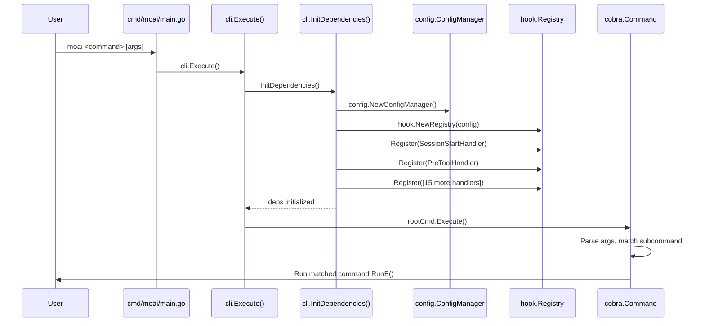

# Entry Points

Catalog of all CLI entry points, hook event dispatchers, and execution modes.

---

## Main Entry Point

| File | Function | Description |
|------|----------|-------------|
| `cmd/moai/main.go` | `main()` | Binary entry point. Calls `cli.Execute()` and exits with code 1 on error. |
| `internal/cli/root.go` | `Execute()` | Initializes dependencies via `InitDependencies()`, then runs the Cobra root command. |
| `internal/cli/deps.go` | `InitDependencies()` | **Composition Root.** Instantiates all services, registers all hook handlers, wires the dependency graph. Called once at startup. |

---

## CLI Command Tree

```
moai
├── init                      internal/cli/init.go
│   └── [flags: --mode, --model-policy, --lang, --force]
│
├── update                    internal/cli/update.go
│   └── [flags: -t/--template-only, -c/--config, --model-policy]
│
├── hook                      internal/cli/hook.go
│   ├── session-start         → hook.Registry.Dispatch("SessionStart", stdin)
│   ├── session-end           → hook.Registry.Dispatch("SessionEnd", stdin)
│   ├── pre-tool-use          → hook.Registry.Dispatch("PreToolUse", stdin)
│   ├── post-tool-use         → hook.Registry.Dispatch("PostToolUse", stdin)
│   ├── post-tool-use-failure → hook.Registry.Dispatch("PostToolUseFailure", stdin)
│   ├── stop                  → hook.Registry.Dispatch("Stop", stdin)
│   ├── teammate-idle         → hook.Registry.Dispatch("TeammateIdle", stdin)
│   ├── task-completed        → hook.Registry.Dispatch("TaskCompleted", stdin)
│   ├── worktree-create       → hook.Registry.Dispatch("WorktreeCreate", stdin)
│   ├── worktree-remove       → hook.Registry.Dispatch("WorktreeRemove", stdin)
│   ├── user-prompt-submit    → hook.Registry.Dispatch("UserPromptSubmit", stdin)
│   ├── permission-request    → hook.Registry.Dispatch("PermissionRequest", stdin)
│   ├── subagent-start        → hook.Registry.Dispatch("SubagentStart", stdin)
│   ├── notification          → hook.Registry.Dispatch("Notification", stdin)
│   └── subagent-stop         → hook.Registry.Dispatch("SubagentStop", stdin)
│
├── worktree                  internal/cli/worktree/ (subpackage)
│   ├── new [branch]          → git.WorktreeManager.Create()
│   ├── list                  → git.WorktreeManager.List()
│   ├── switch [name]         → git.WorktreeManager.Switch()
│   ├── sync                  → git.WorktreeManager.Sync()
│   ├── clean                 → git.WorktreeManager.Clean()
│   └── remove [name]         → git.WorktreeManager.Remove()
│
├── cc                        internal/cli/cc.go
│   └── (no subcommands)      → Removes GLM env vars from ~/.claude/settings.json
│
├── glm [api-key]             internal/cli/glm.go
│   └── (no subcommands)      → Sets GLM env vars in ~/.claude/settings.json
│
├── cg                        internal/cli/cg.go
│   └── (no subcommands)      → Opens tmux split; leader=Claude, workers=GLM
│
├── doctor                    internal/cli/doctor.go
│   └── (no subcommands)      → Runs health checks on project configuration
│
├── github                    internal/cli/github.go
│   └── [subcommands: setup, workflow]
│
├── rank                      internal/cli/rank.go
│   └── [subcommands: login, status, history]
│
├── statusline                internal/cli/statusline.go
│   └── [subcommands: install, uninstall, render]
│
├── status                    internal/cli/status.go
│   └── (no subcommands)      → Prints project phase, quality, and config status
│
└── version                   internal/cli/version.go
    └── (no subcommands)      → Prints semver from pkg/version
```

---

## Hook Event Dispatch Table

Claude Code sends JSON payloads to `moai hook <event>` via stdin. The registry routes each event to its registered handlers.

| Event Name | Shell Wrapper | Handler File | Handler Purpose | Exit Code Semantics |
|-----------|---------------|-------------|-----------------|---------------------|
| `SessionStart` | `handle-session-start.sh` | `session_start.go`, `auto_update.go`, `rank_session.go` | Banner display, update check, rank session start | 0 = ok, 1 = error |
| `SessionEnd` | `handle-session-end.sh` | `session_end.go`, `rank_session.go` | Session cleanup, metrics flush, rank session end | 0 = ok |
| `PreToolUse` | `handle-pre-tool-use.sh` | `pre_tool.go` | AST security scan; can block dangerous tool calls | 0 = allow, 2 = block |
| `PostToolUse` | `handle-post-tool-use.sh` | `post_tool.go`, `post_tool_metrics.go` | LSP diagnostics collection, token metrics | 0 = ok |
| `PostToolUseFailure` | `handle-post-tool-use-failure.sh` | `post_tool_failure.go` | Error reporting | 0 = ok |
| `Stop` | `handle-stop.sh` | `stop.go` | Agent stop signal processing | 0 = ok |
| `TeammateIdle` | `handle-teammate-idle.sh` | `teammate_idle.go` | LSP quality gate check; can reject idle state | 0 = accept idle, 2 = keep working |
| `TaskCompleted` | `handle-task-completed.sh` | `task_completed.go` | Task completion validation | 0 = accept, 2 = reject |
| `WorktreeCreate` | `handle-worktree-create.sh` | `worktree_create.go` | Worktree lifecycle logging (v2.1.49+) | 0 = ok |
| `WorktreeRemove` | `handle-worktree-remove.sh` | `worktree_remove.go` | Worktree cleanup logging (v2.1.49+) | 0 = ok |
| `UserPromptSubmit` | `handle-user-prompt-submit.sh` | `user_prompt_submit.go` | Prompt preprocessing | 0 = ok |
| `PermissionRequest` | `handle-permission-request.sh` | `permission_request.go` | Permission gate — can auto-approve or auto-deny | 0 = prompt user, 1 = deny, 2 = approve |
| `SubagentStart` | `handle-subagent-start.sh` | `subagent_start.go` | Subagent initialization tracking | 0 = ok |
| `Notification` | `handle-notification.sh` | `notification.go` | Notification routing | 0 = ok |
| `PreCompact` | `handle-pre-compact.sh` | `compact.go` | Context compaction preparation | 0 = ok |

Shell wrappers are located at `.claude/hooks/moai/handle-<event>.sh` and call `moai hook <event>` with stdin piped through.

---

## Execution Modes

moai-adk-go supports three execution modes that control which AI model is used for Claude Code sessions. The mode is set by manipulating environment variables in `~/.claude/settings.json`.

### Mode Selection Commands

| Command | Effect | Use Case |
|---------|--------|---------|
| `moai cc` | Removes all GLM env vars from `settings.json` | Use Claude exclusively (opus/sonnet/haiku) |
| `moai glm [key]` | Sets `ANTHROPIC_DEFAULT_*_MODEL` vars to GLM endpoints | Use GLM exclusively for cost reduction |
| `moai cg` | Opens tmux split; leader session uses Claude, worker sessions use GLM | Claude orchestrates, GLM workers implement |

### Environment Variables Modified

| Variable | Claude Mode | GLM Mode |
|----------|------------|---------|
| `ANTHROPIC_DEFAULT_HAIKU_MODEL` | _(not set)_ | `glm-4.7-air` |
| `ANTHROPIC_DEFAULT_SONNET_MODEL` | _(not set)_ | `glm-4.7` |
| `ANTHROPIC_DEFAULT_OPUS_MODEL` | _(not set)_ | `glm-5` |

### Model Policy (Applied at Init/Update)

The `--model-policy` flag on `moai init` and `moai update -c` modifies individual agent definition files to set the `model:` frontmatter field.

| Policy | High-stakes agents | Standard agents | Lightweight agents |
|--------|-------------------|-----------------|-------------------|
| `high` | opus | sonnet | haiku |
| `medium` | opus | sonnet | haiku |
| `low` | sonnet | sonnet | haiku |

Policy application is implemented in `internal/template/model_policy.go`.

---

## Key Startup Sequence



---

## Template Entry Points (Embedded Assets)

The `internal/template/embed.go` file mounts the embedded filesystem:

```
internal/template/embed.go
  //go:embed templates
  var templateFS embed.FS

templates/
  .claude/
    agents/moai/          → 20 agent definition files
    commands/             → Slash command definitions
    hooks/moai/           → Hook wrapper shell scripts
    rules/moai/           → Claude Code rules (CLAUDE.md extensions)
    skills/moai/          → Skill definition files
  .moai/
    config/sections/      → Default YAML config templates
    status_line.sh.tmpl   → Shell status line template
  CLAUDE.md               → Main MoAI execution directives
```

These embedded files are extracted to the user's project directory by `template.Deployer` during `moai init` and `moai update`.
