# moai-adk-go: Architecture Overview

## Project Identity

| Attribute | Value |
|-----------|-------|
| Module | `github.com/modu-ai/moai-adk` |
| Language | Go 1.26 |
| Binary | `moai` |
| Entry Point | `cmd/moai/main.go` |
| Total LOC (approx.) | 40,000+ |
| Internal Packages | 24 |

**Purpose**: moai-adk-go is the runtime backbone of the MoAI framework for Claude Code. It provides a CLI tool that manages agentic development workflows, including project initialization, template deployment, Claude Code hook event handling, LSP quality gates, Git operations, and multi-model execution modes (Claude-only, GLM-only, and Claude+GLM hybrid).

## Technology Stack

| Layer | Technology |
|-------|-----------|
| CLI Framework | cobra v1.10.2 |
| TUI Framework | bubbletea v1.3.10 |
| TUI Components | bubbles v1.0.0 |
| Interactive Prompts | huh v0.8.0 |
| Markdown Rendering | glamour v0.10.0 |
| Terminal Styling | lipgloss v1.1.1+ |
| TTY Detection | go-isatty v0.0.20 |
| YAML Parsing | yaml.v3 v3.0.1 |
| Text Utilities | golang.org/x/text v0.34.0 |
| Build System | Makefile + go generate |

## Architecture Pattern

moai-adk-go follows **Hexagonal (Ports and Adapters) Architecture** combined with **Clean Architecture** layering and a **Composition Root** dependency injection pattern.

Key design decisions:

- **Composition Root in `internal/cli/deps.go`**: All concrete types are instantiated in one place (`InitDependencies()`). CLI commands access services only via interfaces, never concrete types.
- **Interface-first domain contracts**: Every domain module exposes Go interfaces (`Repository`, `Registry`, `Deployer`, etc.). Concrete implementations are hidden inside packages.
- **No circular imports**: Dependency flow is strictly one-directional from presentation to infrastructure.
- **Hook-driven extensibility**: Claude Code integration is achieved through an event handler registry pattern with 24 handler implementations across 17 event types.
- **Embedded template filesystem**: All project templates are compiled into the binary using Go's `go:embed` directive (`internal/template/embed.go`), enabling zero-dependency project initialization.

## Architecture Layer Diagram

```mermaid
graph TB
    subgraph Presentation["Presentation Layer"]
        CLI["internal/cli<br/>Cobra command tree<br/>26K LOC"]
        UI["internal/ui<br/>Bubbletea TUI<br/>components"]
    end

    subgraph Interface["Interface / Protocol Layer"]
        HOOK["internal/hook<br/>Claude Code event<br/>handlers (17 types)"]
        CONFIG["internal/config<br/>YAML config<br/>management"]
        TMUX["internal/tmux<br/>Split-pane<br/>integration"]
    end

    subgraph Domain["Domain Layer"]
        PROJ["internal/core/project<br/>Init, detect,<br/>validate"]
        GIT["internal/core/git<br/>Repository,<br/>Branch, Worktree"]
        QUAL["internal/core/quality<br/>TRUST 5<br/>validation"]
        TEMPLATE["internal/template<br/>Deploy, render,<br/>embed"]
        WORKFLOW["internal/workflow<br/>State management"]
        LOOP["internal/loop<br/>Iterative fix loop"]
        MERGE["internal/merge<br/>3-way file merge"]
    end

    subgraph Infrastructure["Infrastructure Layer"]
        SHELL["internal/shell<br/>Environment<br/>detection"]
        GITHUB["internal/github<br/>GitHub API"]
        RANK["internal/rank<br/>Rank API"]
        LSP["internal/lsp<br/>LSP diagnostics"]
        UPDATE["internal/update<br/>Version check"]
        STATUSLINE["internal/statusline<br/>zsh/bash<br/>status line"]
        RESILIENCE["internal/resilience<br/>Retry & recovery"]
    end

    subgraph Support["Cross-cutting Support"]
        FOUNDATION["internal/foundation<br/>Utility functions"]
        DEFS["internal/defs<br/>Constants"]
        I18N["internal/i18n<br/>Internationalization"]
        MANIFEST["internal/manifest<br/>Template manifest"]
        ASTGREP["internal/astgrep<br/>AST code matching"]
        RALPH["internal/ralph<br/>Reporting"]
    end

    subgraph Public["Public API (pkg/)"]
        MODELS["pkg/models<br/>Config, Project,<br/>Language types"]
        VERSION["pkg/version<br/>Version info"]
    end

    CLI --> HOOK
    CLI --> CONFIG
    CLI --> TMUX
    CLI --> PROJ
    CLI --> GIT
    CLI --> TEMPLATE
    CLI --> UPDATE
    CLI --> RANK
    CLI --> GITHUB
    CLI --> STATUSLINE
    CLI --> WORKFLOW
    CLI --> LOOP

    HOOK --> LSP
    HOOK --> RANK
    HOOK --> CONFIG

    PROJ --> GIT
    PROJ --> SHELL
    PROJ --> TEMPLATE
    PROJ --> MERGE
    PROJ --> MANIFEST

    LOOP --> LSP
    LOOP --> RESILIENCE

    TEMPLATE --> MODELS
    CONFIG --> MODELS

    CLI --> FOUNDATION
    CLI --> DEFS
    CLI --> I18N
```

## Module Statistics

| Category | Package Count | Approx. LOC |
|----------|--------------|-------------|
| Presentation (CLI, UI) | 2 | ~27,000 |
| Interface/Protocol (Hook, Config, Tmux) | 3 | ~12,500 |
| Domain (core/*, template, workflow, loop, merge) | 8 | ~18,000 |
| Infrastructure (shell, github, rank, lsp, update, statusline, resilience) | 7 | ~9,000 |
| Cross-cutting (foundation, defs, i18n, manifest, astgrep, ralph) | 6 | ~2,500 |
| Public API (pkg/) | 2 | ~500 |
| **Total** | **28** | **~69,500** |

## Key Design Decisions

1. **Single binary distribution**: All templates, rules, skills, and agent definitions are embedded in the Go binary. Users get everything with one `go install` command.

2. **Interface segregation for Git**: Git operations are split across three interfaces (`Repository`, `BranchManager`, `WorktreeManager`) to support precise dependency injection and testability.

3. **Hook registry pattern**: Claude Code sends JSON events to stdin; the registry dispatches to typed handlers. Each handler is registered once in `deps.go` and follows the `Handler` interface contract.

4. **Multi-model execution modes**: The `cc`, `glm`, and `cg` commands manipulate `~/.claude/settings.json` environment variables to switch between Claude-only, GLM-only, and Claude+GLM hybrid execution without changing agent definitions.

5. **Template manifest tracking**: The `internal/manifest` package tracks which template files were deployed and at which version, enabling safe `moai update` operations that apply 3-way merges via `internal/merge`.

6. **LSP quality gates**: The `internal/lsp` package integrates with language server diagnostics (with CLI fallbacks) to enforce zero-error quality gates between workflow phases.
