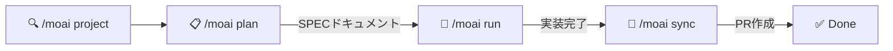
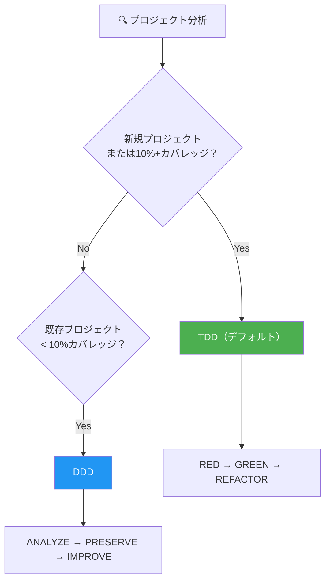
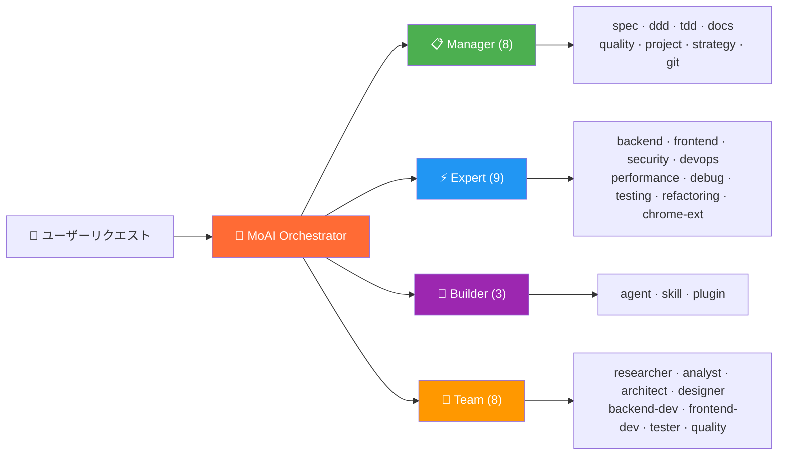
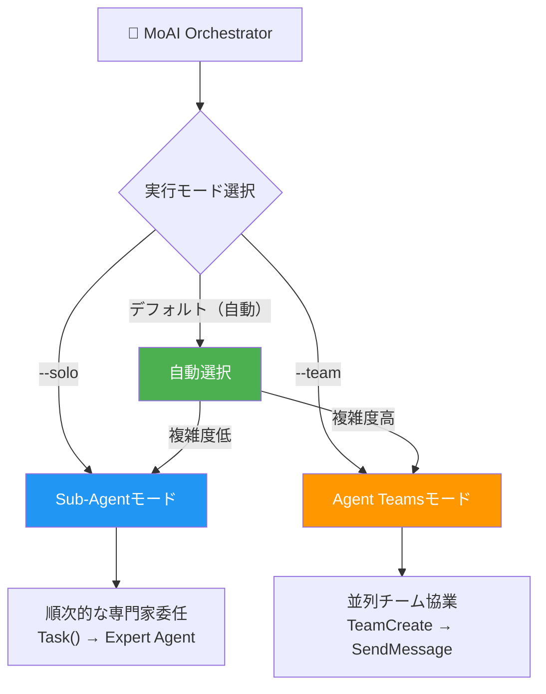
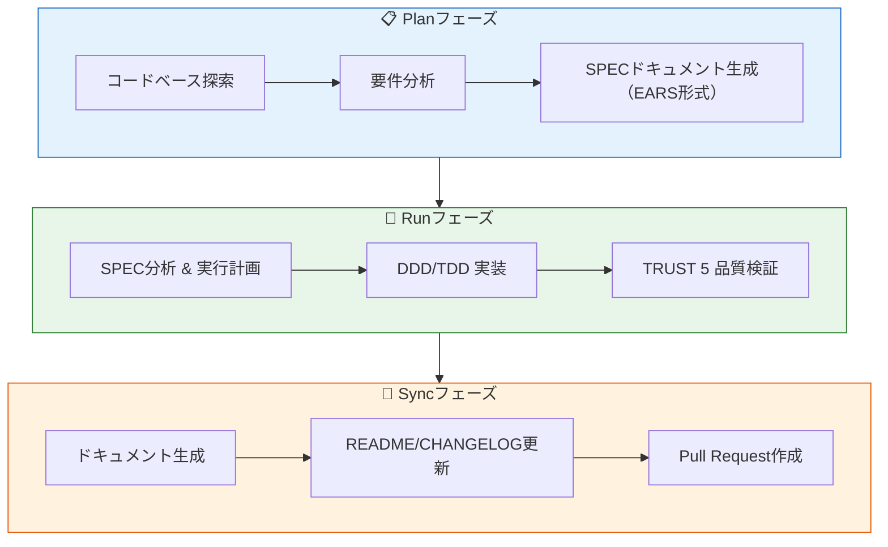

<p align="center">
  
</p>

<h1 align="center">MoAI-ADK</h1>

<p align="center">
  <strong>Claude Codeのための Agentic Development Kit</strong>
</p>

<p align="center">
  <a href="./README.md">English</a> ·
  <a href="./README.ko.md">한국어</a> ·
  <a href="./README.ja.md">日本語</a> ·
  <a href="./README.zh.md">中文</a>
</p>

<p align="center">
  <a href="https://github.com/modu-ai/moai-adk/actions/workflows/ci.yml"></a>
  <a href="https://github.com/modu-ai/moai-adk/actions/workflows/codeql.yml"></a>
  <a href="https://codecov.io/gh/modu-ai/moai-adk"></a>
  <br>
  <a href="https://go.dev/"></a>
  <a href="https://github.com/modu-ai/moai-adk/releases"></a>
  <a href="./LICENSE"></a>
</p>

<p align="center">
  <a href="https://adk.mo.ai.kr"><strong>公式ドキュメント</strong></a>
</p>

---

> 📚 **[公式ドキュメント](https://adk.mo.ai.kr)** | **[GitHub Discussions](https://github.com/modu-ai/moai-adk/discussions)** | **[Discordコミュニティ](https://discord.gg/moai-adk)**

---

> **「バイブコーディングの目的は、素早い生産性ではなく、コード品質である。」**

MoAI-ADKは、Claude Codeのための**高性能AI開発環境**です。28の専門AIエージェントと52のスキルが連携し、品質の高いコードを生み出します。新規プロジェクトと機能開発にはTDD（デフォルト）を、テストカバレッジが低い既存プロジェクトにはDDDを自動的に適用し、Sub-AgentとAgent Teamsの二重実行モードをサポートします。

Goで書かれたシングルバイナリ -- 依存関係なしに、あらゆるプラットフォームで即座に実行できます。

---

## なぜMoAI-ADKなのか？

PythonベースのMoAI-ADK（約73,000行）をGoで完全に書き直しました。

| 項目 | Python Edition | Go Edition |
|------|---------------|------------|
| デプロイ | pip + venv + 依存関係 | **シングルバイナリ**、依存関係なし |
| 起動時間 | ~800ms インタプリタ起動 | **~5ms** ネイティブ実行 |
| 並行処理 | asyncio / threading | **ネイティブgoroutines** |
| 型安全性 | ランタイム（mypy任意） | **コンパイル時に強制** |
| クロスプラットフォーム | Pythonランタイムが必要 | **ビルド済みバイナリ**（macOS, Linux, Windows） |
| フック実行 | Shellラッパー + Python | **コンパイル済みバイナリ**、JSONプロトコル |

### 主要な数値

- **34,220行** Goコード、**32個**のパッケージ
- **85-100%** テストカバレッジ
- **28個** 専門AIエージェント + **52個** スキル
- **18個** プログラミング言語対応
- **16個** Claude Codeフックイベント

---

## システム要件

| プラットフォーム | サポート環境 | 備考 |
|----------------|------------|------|
| macOS | Terminal, iTerm2 | 完全サポート |
| Linux | Bash, Zsh | 完全サポート |
| Windows | **WSL（推奨）**, PowerShell 7.x+ | ネイティブcmd.exeは非サポート |

**前提条件：**
- **Git**が全プラットフォームでインストールされている必要があります
- **Windowsユーザー**: [Git for Windows](https://gitforwindows.org/)が**必須**です（Git Bash含む）
  - **WSL**（Windows Subsystem for Linux）の使用を推奨します
  - PowerShell 7.x以上も対応しています
  - レガシーWindows PowerShell 5.xおよびcmd.exeは**非サポート**です

---

## クイックスタート

### 1. インストール

#### macOS / Linux / WSL

```bash
curl -fsSL https://raw.githubusercontent.com/modu-ai/moai-adk/main/install.sh | bash
```

#### Windows（PowerShell 7.x+）

> **推奨**: 最適な体験のため、WSLで上記のLinuxインストールコマンドを使用してください。

```powershell
irm https://raw.githubusercontent.com/modu-ai/moai-adk/main/install.ps1 | iex
```

> [Git for Windows](https://gitforwindows.org/)が先にインストールされている必要があります。

#### ソースからビルド（Go 1.26+）

```bash
git clone https://github.com/modu-ai/moai-adk.git
cd moai-adk && make build
```

> ビルド済みバイナリは[Releases](https://github.com/modu-ai/moai-adk/releases)ページからダウンロードできます。

### 2. プロジェクトの初期化

```bash
moai init my-project
```

対話型ウィザードが言語、フレームワーク、方法論を自動検出し、Claude Code統合ファイルを生成します。

### 3. Claude Codeで開発を開始

```bash
# Claude Code 起動後
/moai project                            # プロジェクトドキュメント生成（product.md, structure.md, tech.md）
/moai plan "ユーザー認証機能を追加"       # SPECドキュメント生成
/moai run SPEC-AUTH-001                   # DDD/TDD 実装
/moai sync SPEC-AUTH-001                  # ドキュメント同期 & PR作成
```



---

## MoAI開発方法論

MoAI-ADKは、プロジェクトの状態に応じて最適な開発方法論を自動選択します。



### TDD方法論（デフォルト）

新規プロジェクトおよび機能開発に推奨されるデフォルトの方法論です。テストを先に書きます。

| フェーズ | 説明 |
|---------|------|
| **RED** | 期待される振る舞いを定義する失敗テストを作成 |
| **GREEN** | テストを通過する最小限のコードを作成 |
| **REFACTOR** | テストを維持しながらコード品質を改善 |

ブラウンフィールドプロジェクト（既存コードベース）では、**RED前の分析ステップ**が追加されます：テスト作成前に既存コードを読んで現在の振る舞いを把握します。

### DDD方法論（カバレッジ < 10%の既存プロジェクト）

テストカバレッジが最小限の既存プロジェクトで安全にリファクタリングするための方法論です。

```
ANALYZE   → 既存コードと依存関係の分析、ドメイン境界の特定
PRESERVE  → 特性テストの作成、現在の振る舞いのスナップショット取得
IMPROVE   → テストで保護された状態での段階的な改善
```

> 方法論は `moai init` 時に自動選択され（`--mode <ddd|tdd>`、デフォルト: tdd）、`.moai/config/sections/quality.yaml` の `development_mode` で変更できます。
>
> **注意**: MoAI-ADK v2.5.0+では、バイナリ方法論選択（TDDまたはDDDのみ）を使用しています。ハイブリッドモードは明確性と一貫性を保つために削除されました。

---

## AIエージェントオーケストレーション

MoAIは**戦略的オーケストレーター**です。直接コードを書くのではなく、28の専門エージェントにタスクを委任します。



### エージェントカテゴリ

| カテゴリ | 数量 | エージェント | 役割 |
|----------|------|---------|------|
| **Manager** | 8 | spec, ddd, tdd, docs, quality, project, strategy, git | ワークフロー調整、SPEC作成、品質管理 |
| **Expert** | 9 | backend, frontend, security, devops, performance, debug, testing, refactoring, chrome-extension | ドメイン専門の実装、分析、最適化 |
| **Builder** | 3 | agent, skill, plugin | 新しいMoAIコンポーネントの作成 |
| **Team** | 8 | researcher, analyst, architect, designer, backend-dev, frontend-dev, tester, quality | 並列チームベースの開発 |

### 52スキル（プログレッシブディスクロージャー）

トークン効率のため、3段階のプログレッシブディスクロージャーシステムで管理されています：

| カテゴリ | スキル数 | 例 |
|----------|---------|------|
| **Foundation** | 5 | core, claude, philosopher, quality, context |
| **Workflow** | 11 | spec, project, ddd, tdd, testing, worktree, thinking... |
| **Domain** | 5 | backend, frontend, database, uiux, data-formats |
| **Language** | 18 | Go, Python, TypeScript, Rust, Java, Kotlin, Swift, C++... |
| **Platform** | 9 | Vercel, Supabase, Firebase, Auth0, Clerk, Railway... |
| **Library** | 3 | shadcn, nextra, mermaid |
| **Tool** | 2 | ast-grep, svg |
| **Specialist** | 11 | Figma, Flutter, Chrome Extension, Pencil... |

---

## モデルポリシー（トークン最適化）

MoAI-ADKは、Claude Codeサブスクリプションプランに基づいて、28のエージェントに最適なAIモデルを割り当てます。プランのレート制限内で品質を最大化します。

| ポリシー | プラン | 🟣 Opus | 🔵 Sonnet | 🟡 Haiku | 用途 |
|----------|--------|------|--------|-------|------|
| **High** | Max $200/月 | 23 | 1 | 4 | 最高品質、最大スループット |
| **Medium** | Max $100/月 | 4 | 19 | 5 | 品質とコストのバランス |
| **Low** | Plus $20/月 | 0 | 12 | 16 | 経済的、Opusなし |

> **なぜ重要なのか？** Plus $20プランにはOpusが含まれていません。`Low`に設定すると、すべてのエージェントがSonnetとHaikuのみを使用し、レート制限エラーを防止します。上位プランでは、重要なエージェント（セキュリティ、戦略、アーキテクチャ）にOpusを、通常タスクにSonnet/Haikuを配分します。

### ティア別エージェントモデル配分

#### Manager Agents

| エージェント | High | Medium | Low |
|------------|------|--------|-----|
| manager-spec | 🟣 opus | 🟣 opus | 🔵 sonnet |
| manager-strategy | 🟣 opus | 🟣 opus | 🔵 sonnet |
| manager-ddd | 🟣 opus | 🔵 sonnet | 🔵 sonnet |
| manager-tdd | 🟣 opus | 🔵 sonnet | 🔵 sonnet |
| manager-project | 🟣 opus | 🔵 sonnet | 🟡 haiku |
| manager-docs | 🔵 sonnet | 🟡 haiku | 🟡 haiku |
| manager-quality | 🟡 haiku | 🟡 haiku | 🟡 haiku |
| manager-git | 🟡 haiku | 🟡 haiku | 🟡 haiku |

#### Expert Agents

| エージェント | High | Medium | Low |
|------------|------|--------|-----|
| expert-backend | 🟣 opus | 🔵 sonnet | 🔵 sonnet |
| expert-frontend | 🟣 opus | 🔵 sonnet | 🔵 sonnet |
| expert-security | 🟣 opus | 🟣 opus | 🔵 sonnet |
| expert-debug | 🟣 opus | 🔵 sonnet | 🔵 sonnet |
| expert-refactoring | 🟣 opus | 🔵 sonnet | 🔵 sonnet |
| expert-devops | 🟣 opus | 🔵 sonnet | 🟡 haiku |
| expert-performance | 🟣 opus | 🔵 sonnet | 🟡 haiku |
| expert-testing | 🟣 opus | 🔵 sonnet | 🟡 haiku |
| expert-chrome-extension | 🟣 opus | 🔵 sonnet | 🟡 haiku |

#### Builder Agents

| エージェント | High | Medium | Low |
|------------|------|--------|-----|
| builder-agent | 🟣 opus | 🔵 sonnet | 🟡 haiku |
| builder-skill | 🟣 opus | 🔵 sonnet | 🟡 haiku |
| builder-plugin | 🟣 opus | 🔵 sonnet | 🟡 haiku |

#### Team Agents

| エージェント | High | Medium | Low |
|------------|------|--------|-----|
| team-architect | 🟣 opus | 🟣 opus | 🔵 sonnet |
| team-analyst | 🟣 opus | 🔵 sonnet | 🟡 haiku |
| team-designer | 🟣 opus | 🔵 sonnet | 🟡 haiku |
| team-backend-dev | 🟣 opus | 🔵 sonnet | 🔵 sonnet |
| team-frontend-dev | 🟣 opus | 🔵 sonnet | 🔵 sonnet |
| team-tester | 🟣 opus | 🔵 sonnet | 🟡 haiku |
| team-researcher | 🟡 haiku | 🟡 haiku | 🟡 haiku |
| team-quality | 🟡 haiku | 🟡 haiku | 🟡 haiku |

### 設定方法

```bash
# プロジェクト初期化時
moai init my-project          # 対話型ウィザードでモデルポリシーを選択

# 既存プロジェクトの再設定
moai update                   # 対話型ウィザードで各設定ステップを案内
```

`moai update` 実行時に以下の質問が表示されます：
- **モデルポリシーをリセットしますか？** (y/n) - モデルポリシー設定ウィザードを再実行
- **GLM設定を更新しますか？** (y/n) - settings.local.jsonでGLM環境変数を設定

> デフォルトポリシーは `High` です。GLM設定は `settings.local.json` に分離され、Gitに追跡されません。

---

## 二重実行モード

MoAI-ADKは、Claude Codeがサポートする**Agent Teams**（デフォルト）と**Sub-Agent**の2つの実行モードを提供します。



### Agent Teamsモード（デフォルト）

MoAI-ADKはプロジェクトの複雑度を自動分析し、最適な実行モードを選択します：

| 条件 | 選択モード | 理由 |
|------|-----------|------|
| ドメイン3つ以上 | Agent Teams | マルチドメイン協調 |
| 影響ファイル10以上 | Agent Teams | 大規模変更 |
| 複雑度スコア7以上 | Agent Teams | 高複雑度 |
| その他 | Sub-Agent | シンプル、予測可能 |

**Agent Teamsモード**は並列チームベースの開発を使用します：

- 複数のエージェントが同時に作業し、共有タスクリストで協業
- `TeamCreate`、`SendMessage`、`TaskList` によるリアルタイム調整
- 大規模な機能開発やマルチドメインタスクに最適

```bash
/moai plan "大規模機能"          # 自動: researcher + analyst + architect 並列
/moai run SPEC-XXX               # 自動: backend-dev + frontend-dev + tester 並列
/moai run SPEC-XXX --team        # Agent Teamsモードを強制
```

**Agent Teams向け品質フック：**
- **TeammateIdle Hook**: チームメートがアイドル状態になる前にLSP品質ゲートを検証（エラー、型エラー、リントエラー）
- **TaskCompleted Hook**: タスクがSPEC-XXXパターンを参照する場合、SPECドキュメントの存在を検証
- すべての検証はグレースフルデグラデーション - 警告をログに記録しますが作業は続行します

### Sub-Agentモード（`--solo`）

Claude Codeの `Task()` APIを使用した順次的なエージェント委任方式です。

- 1つの専門エージェントにタスクを委任し、結果を受け取る
- 段階的にManager → Expert → Qualityの順に進行
- シンプルで予測可能なワークフローに最適

```bash
/moai run SPEC-AUTH-001 --solo    # Sub-Agentモードを強制
```

---

## MoAIワークフロー

### Plan → Run → Sync パイプライン

MoAIの中核ワークフローは3つのフェーズで構成されています：



### /moai サブコマンド

すべてのサブコマンドはClaude Code内で `/moai <subcommand>` として呼び出されます。

#### コアワークフロー

| サブコマンド | エイリアス | 目的 | 主要フラグ |
|------------|---------|------|----------|
| `plan` | `spec` | SPECドキュメント作成（EARS形式） | `--worktree`, `--branch`, `--resume SPEC-XXX`, `--team` |
| `run` | `impl` | SPECのDDD/TDD実装 | `--resume SPEC-XXX`, `--team` |
| `sync` | `docs`, `pr` | ドキュメント同期、コードマップ、PR作成 | `--merge`, `--skip-mx` |

#### 品質とテスト

| サブコマンド | エイリアス | 目的 | 主要フラグ |
|------------|---------|------|----------|
| `fix` | — | LSPエラー、リンティング、型エラーの自動修正（シングルパス） | `--dry`, `--seq`, `--level N`, `--resume`, `--team` |
| `loop` | — | 反復自動修正（最大100回まで完了） | `--max N`, `--auto-fix`, `--seq` |
| `review` | `code-review` | セキュリティと@MXタグコンプライアンス確認を含むコードレビュー | `--staged`, `--branch`, `--security` |
| `coverage` | `test-coverage` | テストカバレッジ分析とギャップ埋め（16言語対応） | `--target N`, `--file PATH`, `--report` |
| `e2e` | — | E2Eテスト（Claude-in-Chrome、Playwright CLI、またはAgent Browser） | `--record`, `--url URL`, `--journey NAME` |
| `clean` | `refactor-clean` | デッドコード識別と安全な削除 | `--dry`, `--safe-only`, `--file PATH` |

#### ドキュメントとコードベース

| サブコマンド | エイリアス | 目的 | 主要フラグ |
|------------|---------|------|----------|
| `project` | `init` | プロジェクトドキュメント生成（product.md, structure.md, tech.md, .moai/project/codemaps/） | — |
| `mx` | — | コードベース走査と@MXコード注釈追加 | `--all`, `--dry`, `--priority P1-P4`, `--force`, `--team` |
| `codemaps` | `update-codemaps` | `.moai/project/codemaps/` にアーキテクチャドキュメント生成 | `--force`, `--area AREA` |
| `feedback` | `fb`, `bug`, `issue` | ユーザーフィードバック収集とGitHub Issue作成 | — |

#### デフォルトワークフロー

| サブコマンド | 目的 | 主要フラグ |
|------------|------|----------|
| *(なし)* | 完全自律的な plan → run → sync パイプライン。複雑度スコア >= 5 の場合、SPECを自動生成 | `--loop`, `--max N`, `--branch`, `--pr`, `--resume SPEC-XXX`, `--team`, `--solo` |

### 実行モードフラグ

ワークフロー実行中のエージェント送信方法を制御します：

| フラグ | モード | 説明 |
|-------|--------|------|
| `--team` | Agent Teams | 並列チームベースの実行。複数のエージェントが同時に作業 |
| `--solo` | Sub-Agent | 段階ごとの順次シングルエージェント委任 |
| *(デフォルト)* | 自動 | 複雑度に基づいてシステムが自動選択（ドメイン >= 3、ファイル >= 10、スコア >= 7） |

**`--team` は3つの実行環境をサポートしています：**

| 環境 | コマンド | リーダー | ワーカー | 用途 |
|------|---------|---------|---------|------|
| Claude-only | `moai cc` | Claude | Claude | 最高品質 |
| GLM-only | `moai glm` | GLM | GLM | 最大コスト削減 |
| CG (Claude+GLM) | `moai cg` | Claude | GLM | 品質とコストのバランス |

> **注意**: `moai cg` はtmuxペーンレベルの環境隔離を使用してClaudeリーダーとGLMワーカーを分離します。`moai glm` から切り替える場合、`moai cg` は自動的にGLM設定を最初にリセットします -- `moai cc` を実行する必要はありません。

### 自律開発ループ（Ralph Engine）

LSP診断とAST-grepを組み合わせた自律的なエラー修正エンジンです：

```bash
/moai fix       # シングルパス：スキャン → 分類 → 修正 → 検証
/moai loop      # 反復修正：完了マーカー検出まで繰り返し（最大100回）
```

**Ralph Engineの動作：**
1. **並列スキャン**: LSP診断 + AST-grep + リンターを同時実行
2. **自動分類**: エラーをLevel 1（自動修正）～ Level 4（ユーザー介入）に分類
3. **収束検知**: 同一エラーの繰り返し時に代替戦略を適用
4. **完了条件**: 0エラー、0型エラー、85%以上のカバレッジ

### 推奨ワークフローチェーン

**新機能開発：**
```
/moai plan → /moai run SPEC-XXX → /moai review → /moai coverage → /moai sync SPEC-XXX
```

**バグ修正：**
```
/moai fix (または /moai loop) → /moai review → /moai sync
```

**リファクタリング：**
```
/moai plan → /moai clean → /moai run SPEC-XXX → /moai review → /moai coverage → /moai codemaps
```

**ドキュメント更新：**
```
/moai codemaps → /moai sync
```

---

## TRUST 5 品質フレームワーク

すべてのコード変更は、5つの品質基準で検証されます：

| 基準 | 説明 | 検証項目 |
|------|------|-----------|
| **T**ested | テスト済み | 85%以上のカバレッジ、特性テスト、ユニットテスト合格 |
| **R**eadable | 可読性が高い | 明確な命名規則、一貫したコードスタイル、リントエラー0 |
| **U**nified | 統一されている | 一貫したフォーマット、インポート順序、プロジェクト構造の遵守 |
| **S**ecured | 安全である | OWASP準拠、入力検証、セキュリティ警告0 |
| **T**rackable | 追跡可能 | コンベンショナルコミット、Issue参照、構造化ログ |

---

## タスクメトリクスロギング

MoAI-ADKは開発セッション中のTaskツールメトリクスを自動的にキャプチャします：

- **ロケーション**: `.moai/logs/task-metrics.jsonl`
- **キャプチャメトリクス**: トークン使用量、ツール呼び出し、実行時間、エージェント型
- **目的**: セッション分析、パフォーマンス最適化、コスト追跡

メトリクスはTaskツール完了時にPostToolUseフックによってログに記録されます。このデータを使用してエージェントの効率を分析し、トークン消費を最適化します。

---

## CLIコマンド

| コマンド | 説明 |
|--------|------|
| `moai init` | 対話型プロジェクト設定（言語/フレームワーク/方法論の自動検出） |
| `moai doctor` | システム状態の診断と環境検証 |
| `moai status` | Gitブランチ、品質メトリクスなどのプロジェクト状態概要 |
| `moai update` | 最新バージョンへのアップデート（自動ロールバック対応） |
| `moai update --check` | インストールなしでアップデートを確認 |
| `moai update --project` | プロジェクトテンプレートのみ同期 |
| `moai worktree new <name>` | 新しいGit worktreeを作成（並列ブランチ開発） |
| `moai worktree list` | アクティブなworktree一覧 |
| `moai worktree switch <name>` | worktreeの切り替え |
| `moai worktree sync` | アップストリームと同期 |
| `moai worktree remove <name>` | worktreeの削除 |
| `moai worktree clean` | 古いworktreeのクリーンアップ |
| `moai worktree go <name>` | 現在のシェルでworktreeディレクトリに移動 |
| `moai hook <event>` | Claude Codeフックディスパッチャー |
| `moai glm` | GLM 5 APIでClaude Codeを起動（コスト効率的な代替案） |
| `moai cc` | GLM設定なしでClaude Codeを起動（Claude専用モード） |
| `moai cg` | CG モードを有効化 — Claudeリーダー + GLMチームメート（tmuxペーンレベル隔離） |
| `moai version` | バージョン、コミットハッシュ、ビルド日時の情報 |

---

## CG モード（Claude + GLM ハイブリッド）

CG モードは、リーダーが **Claude API**、ワーカーが **GLM API** を使用するハイブリッドモードです。tmux セッションレベルの環境変数によるペーン隔離で実現されます。

### 仕組み

```
moai cg 実行
    │
    ├── 1. tmux セッション環境変数に GLM 設定を注入
    │      (ANTHROPIC_AUTH_TOKEN, BASE_URL, MODEL_* 変数)
    │
    ├── 2. settings.local.json から GLM 環境変数を削除
    │      → リーダーペーンは Claude API を使用
    │
    └── 3. CLAUDE_CODE_TEAMMATE_DISPLAY=tmux を設定
           → ワーカーは新しいペーンで GLM 環境変数を継承

┌─────────────────────────────────────────────────────────────┐
│  LEADER（現在の tmux ペーン、Claude API）                    │
│  - /moai --team 実行時にワークフローを調整                    │
│  - plan、quality、sync フェーズを処理                        │
│  - GLM 環境変数なし → Claude API を使用                      │
└──────────────────────┬──────────────────────────────────────┘
                       │ Agent Teams（新しい tmux ペーン）
                       ▼
┌─────────────────────────────────────────────────────────────┐
│  TEAMMATES（新しい tmux ペーン、GLM API）                    │
│  - tmux セッション環境変数を継承 → GLM API を使用             │
│  - run フェーズの実装タスクを実行                            │
│  - SendMessage でリーダーと通信                             │
└─────────────────────────────────────────────────────────────┘
```

### 使い方

```bash
# 1. GLM API キーを保存（初回のみ）
moai glm sk-your-glm-api-key

# 2. tmux 環境を確認（既に tmux 使用中はスキップ）
# 新しい tmux セッションが必要な場合:
tmux new -s moai

# TIP: VS Code ターミナルのデフォルトを tmux に設定すると、
# 自動的に tmux 環境で起動され、この手順をスキップできます。

# 3. CG モードを有効化
moai cg

# 4. 同じペーンで Claude Code を起動（重要！）
claude

# 5. チームワークフローを実行
/moai --team "タスクの説明"
```

### 注意事項

| 項目 | 説明 |
|------|------|
| **tmux 環境** | 既に tmux を使用中のターミナルでは新しいセッション作成は不要。VS Code ターミナルのデフォルトを tmux に設定すると便利。 |
| **リーダー起動場所** | 必ず `moai cg` を実行した **同じペーン** で Claude Code を起動。新しいペーンで起動すると GLM 環境変数を継承。 |
| **セッション終了時** | session_end フックが tmux セッション環境変数を自動削除 → 次セッションは Claude に復帰 |
| **Agent Teams 通信** | SendMessage ツールでリーダー↔ワーカー間の通信が可能 |

### モード比較

| コマンド | リーダー | ワーカー | tmux 必要 | コスト削減 | 使用シナリオ |
|----------|----------|----------|-----------|------------|--------------|
| `moai cc` | Claude | Claude | 不要 | - | 複雑な作業、最高品質 |
| `moai glm` | GLM | GLM | 推奨 | ~70% | コスト最適化 |
| `moai cg` | Claude | GLM | **必須** | **~60%** | 品質とコストのバランス |

### 表示モード

Agent Teams は 2 つの表示モードをサポート:

| モード | 説明 | 通信 | リーダー/ワーカー分離 |
|--------|------|------|----------------------|
| `in-process` | デフォルトモード、すべてのターミナル | ✅ SendMessage | ❌ 同じ環境変数 |
| `tmux` | 分割ペイン表示 | ✅ SendMessage | ✅ セッション環境変数分離 |

**CG モードは `tmux` 表示モードでのみリーダー/ワーカー API 分離が可能です。**

---

## アーキテクチャ

```
moai-adk/
├── cmd/moai/             # アプリケーションエントリポイント
├── internal/             # コアプライベートパッケージ
│   ├── astgrep/          # AST-grep統合（構造的コード分析）
│   ├── cli/              # Cobra CLIコマンド定義
│   ├── config/           # スレッドセーフなYAML設定管理
│   ├── core/
│   │   ├── git/          # Git操作（ブランチ、worktree、コンフリクト検出）
│   │   ├── project/      # プロジェクト初期化、言語/フレームワーク検出
│   │   └── quality/      # TRUST 5 品質ゲート、並列バリデーター
│   ├── defs/             # 言語定義とフレームワーク検出
│   ├── git/              # Gitコンベンション検証エンジン
│   ├── hook/             # コンパイル済みフックシステム（16個のイベント、JSONプロトコル）
│   ├── loop/             # Ralphフィードバックループ（状態マシン、収束検知）
│   ├── lsp/              # LSPクライアント（16以上の言語、並列サーバー管理）
│   ├── manifest/         # ファイル追跡（SHA-256整合性）
│   ├── merge/            # 3-wayマージエンジン（6つの戦略）
│   ├── rank/             # MoAI Rank同期とトランスクリプト管理
│   ├── resilience/       # リトライポリシーとサーキットブレーカー
│   ├── shell/            # シェル統合（worktreeナビゲーション）
│   ├── statusline/       # Claude Codeステータスライン統合
│   ├── template/         # テンプレートデプロイ（go:embed）、設定生成
│   ├── ui/               # 対話型TUI（セレクター、チェックボックス、ウィザード）
│   └── update/           # バイナリ自己更新メカニズム
├── pkg/                  # パブリックライブラリパッケージ
│   ├── models/           # 共有データモデル
│   └── version/          # ビルドバージョンメタデータ
└── Makefile              # ビルド自動化
```

### 主要パッケージカバレッジ

| パッケージ | 目的 | カバレッジ |
|--------|------|----------|
| `foundation` | EARSパターン、TRUST 5、18言語定義 | 98.4% |
| `core/quality` | 並列バリデーター、フェーズゲート | 96.8% |
| `ui` | 対話型TUIコンポーネント | 96.8% |
| `config` | スレッドセーフYAML設定 | 94.1% |
| `loop` | Ralphフィードバックループ、収束検知 | 92.7% |
| `cli` | Cobraコマンド | 92.0% |
| `ralph` | 収束判定エンジン | 100% |
| `statusline` | Claude Codeステータスライン | 100% |

---

## @MX Tag System

MoAI-ADKは**@MXコード注釈システム**を使用して、AIエージェント間のコンテキスト、不変量、危険ゾーンを伝達します。

### @MXタグとは？

@MXタグはインラインコード注釈で、AIエージェントがコードベースをより速く、より正確に理解するのに役立ちます。

```go
// @MX:ANCHOR: [AUTO] Hook registry dispatch - 5+ callers
// @MX:REASON: [AUTO] Central entry point for all hook events, changes have wide impact
func DispatchHook(event string, data []byte) error {
    // ...
}

// @MX:WARN: [AUTO] Goroutine executes without context.Context
// @MX:REASON: [AUTO] Cannot cancel goroutine, potential resource leak
func processAsync() {
    go func() {
        // ...
    }()
}
```

### タグ型

| タグ型 | 目的 | 説明 |
|--------|------|------|
| `@MX:ANCHOR` | 重要な契約 | fan_in >= 3 の関数、変更による広範な影響 |
| `@MX:WARN` | 危険ゾーン | Goroutines、複雑度 >= 15、グローバル状態変更 |
| `@MX:NOTE` | コンテキスト | マジック定数、godoc不足、ビジネスルール |
| `@MX:TODO` | 未完了作業 | テストなし、未実装機能 |

### なぜすべてのコードに@MXタグがないのか？

@MXタグシステムは**すべてのコードにタグを追加するためではなく設計されていません。** 中核原則は**「AIが最初に気付く必要がある最も危険/重要なコードのみをマークする」**ことです。

| 優先度 | 条件 | タグ型 |
|--------|------|--------|
| **P1（致命的）** | fan_in >= 3 | `@MX:ANCHOR` |
| **P2（危険）** | goroutine、複雑度 >= 15 | `@MX:WARN` |
| **P3（コンテキスト）** | マジック定数、godocなし | `@MX:NOTE` |
| **P4（欠落）** | テストファイルなし | `@MX:TODO` |

**ほとんどのコードはいずれの条件も満たさないため、タグはありません。** これは**正常です**。

### 例：タグ判定

```go
// ❌ タグなし（fan_in = 1、低複雑度）
func calculateTotal(items []Item) int {
    total := 0
    for _, item := range items {
        total += item.Price
    }
    return total
}

// ✅ @MX:ANCHOR 追加（fan_in = 5）
// @MX:ANCHOR: [AUTO] Config manager load - 5+ callers
// @MX:REASON: [AUTO] Entry point for all CLI commands
func LoadConfig() (*Config, error) {
    // ...
}
```

### 設定（`.moai/config/sections/mx.yaml`）

```yaml
thresholds:
  fan_in_anchor: 3        # < 3 callers = no ANCHOR
  complexity_warn: 15     # < 15 complexity = no WARN
  branch_warn: 8          # < 8 branches = no WARN

limits:
  anchor_per_file: 3      # Max 3 ANCHOR tags per file
  warn_per_file: 5        # Max 5 WARN tags per file

exclude:
  - "**/*_generated.go"   # Exclude generated files
  - "**/vendor/**"        # Exclude external libraries
  - "**/mock_*.go"        # Exclude mock files
```

### MX Tag スキャン実行

```bash
# コードベース全体をスキャン（Goプロジェクト）
/moai mx --all

# プレビューのみ（ファイル修正なし）
/moai mx --dry

# 優先度でスキャン（P1のみ）
/moai mx --priority P1

# 特定の言語のみスキャン
/moai mx --all --lang go,python
```

### 他のプロジェクトも@MXタグが少ない理由

| 状況 | 理由 |
|-----|------|
| **新規プロジェクト** | ほとんどの関数 fan_in = 0 → タグなし（正常） |
| **小規模プロジェクト** | 関数少数 = シンプルなコールグラフ = タグ少数 |
| **高品質コード** | 低複雑度、goroutineなし → WARNタグなし |
| **高い閾値** | `fan_in_anchor: 5` = さらに少ないタグ |

### 中核原則

@MXタグシステムは**「シグナルとノイズの比率」**を最適化します：

- ✅ **本当に重要なコードのみをマーク** → AIが中核領域を素早く識別
- ❌ **すべてのコードにタグ付け** → ノイズが増加、重要なタグが見つけにくくなる

---

## よくある質問

### Q: なぜすべてのGoコードに@MXタグがないのか？

**A: これは正常です。** @MXタグは「必要な場所にのみ」追加されます。ほとんどのコードはシンプルで安全なため、タグは必要ありません。

| 質問 | 回答 |
|------|------|
| タグがないのは問題か？ | **いいえ。** ほとんどのコードはタグを必要としません。 |
| タグはいつ追加されるか？ | **高い fan_in**、**複雑なロジック**、**危険パターン**のみ |
| すべてのプロジェクトは似ているか？ | **はい。** すべてのプロジェクトのほとんどのコードはタグを持たちません。 |

詳細は上記の**「@MX Tag System」**セクションを参照してください。

---

### Q: ステータスラインで表示されるセグメントをカスタマイズするにはどうすればいいですか？

ステータスラインは4つの表示プリセットとカスタム設定をサポートしています：

- **Full**（デフォルト）: すべて8セグメント表示
- **Compact**: モデル + コンテキスト + Git Status + ブランチのみ
- **Minimal**: モデル + コンテキストのみ
- **Custom**: 個別セグメントを選択

`moai init` / `moai update` ウィザード中に設定（「ステータスラインをリセットしますか？」に「y」で回答）、または `.moai/config/sections/statusline.yaml` を編集：

```yaml
statusline:
  preset: compact  # or full, minimal, custom
  segments:
    model: true
    context: true
    output_style: false
    directory: false
    git_status: true
    claude_version: false
    moai_version: false
    git_branch: true
```

詳細は [SPEC-STATUSLINE-001](.moai/specs/SPEC-STATUSLINE-001/spec.md) をご参照ください。

---

### Q: ステータスラインのバージョンインジケータはどういう意味ですか？

MoAIステータスラインはアップデート通知付きのバージョン情報を表示します：

```
🗿 v2.2.2 ⬆️ v2.2.5
```

- **`v2.2.2`**: 現在インストールされているバージョン
- **`⬆️ v2.2.5`**: 利用可能な新バージョン

最新バージョンを使用している場合、バージョン番号のみが表示されます：
```
🗿 v2.2.5
```

**アップデート**: `moai update` を実行すると、アップデート通知は消えます。

**注意**: これはClaude Codeの組み込みバージョンインジケータ（`🔅 v2.1.38`）とは異なります。MoAIインジケータはMoAI-ADKバージョンを追跡し、Claude Codeは自身のバージョンを別途表示します。

---

### Q: 「外部CLAUDE.mdファイルのインポートを許可しますか？」という警告が表示されます

プロジェクトを開くとき、Claude Codeは外部ファイルインポートについてのセキュリティプロンプトを表示することがあります：

```
External imports:
  /Users/<user>/.moai/config/sections/quality.yaml
  /Users/<user>/.moai/config/sections/user.yaml
  /Users/<user>/.moai/config/sections/language.yaml
```

**推奨アクション**: **「いいえ、外部インポートを無効にします」** を選択 ✅

**なぜか？**
- プロジェクトの `.moai/config/sections/` にはこれらのファイルが既に含まれています
- プロジェクト固有の設定はグローバル設定より優先されます
- 必須設定はCLAUDE.mdテキストに既に埋め込まれています
- 外部インポートを無効にしても機能に影響しません、より安全です

**これらのファイルは何か？**
- `quality.yaml`: TRUST 5フレームワークと開発方法論設定
- `language.yaml`: 言語設定（会話、コメント、コミット）
- `user.yaml`: ユーザー名（Co-Authored-Byアトリビューションの場合は任意）

---

## コントリビューション

コントリビューションを歓迎します！ 詳しいガイドは[CONTRIBUTING.md](CONTRIBUTING.md)をご覧ください。

### クイックスタート

1. リポジトリをフォークしてください
2. フィーチャーブランチを作成：`git checkout -b feature/my-feature`
3. テストを作成（新規コードはTDD、既存コードは特性テスト）
4. すべてのテストの合格を確認：`make test`
5. リンティングの合格を確認：`make lint`
6. コードフォーマット：`make fmt`
7. コンベンショナルコミットメッセージでコミット
8. プルリクエストをオープン

**コード品質要件**：85%以上のカバレッジ / リントエラー0 / 型エラー0 / コンベンショナルコミット

### コミュニティ

- [GitHub Discussions](https://github.com/modu-ai/moai-adk/discussions) -- 質問、アイデア、フィードバック
- [Discordコミュニティ](https://discord.gg/moai-adk) -- リアルタイムチャット、ヒント共有
- [Issues](https://github.com/modu-ai/moai-adk/issues) -- バグ報告、機能リクエスト

---

## Star History

[](https://www.star-history.com/#modu-ai/moai-adk&type=date&legend=top-left)

---

## ライセンス

[Copyleft 3.0](./LICENSE) -- 詳細はLICENSEファイルをご参照ください。

## 関連リンク

- [公式ドキュメント](https://adk.mo.ai.kr)
- [Claude Code](https://docs.anthropic.com/en/docs/claude-code)
- [GitHub Discussions](https://github.com/modu-ai/moai-adk/discussions) -- 質問、アイデア、コミュニティ
- [Discordコミュニティ](https://discord.gg/moai-adk) -- リアルタイムチャット、ヒント共有
