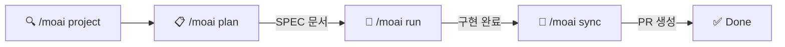
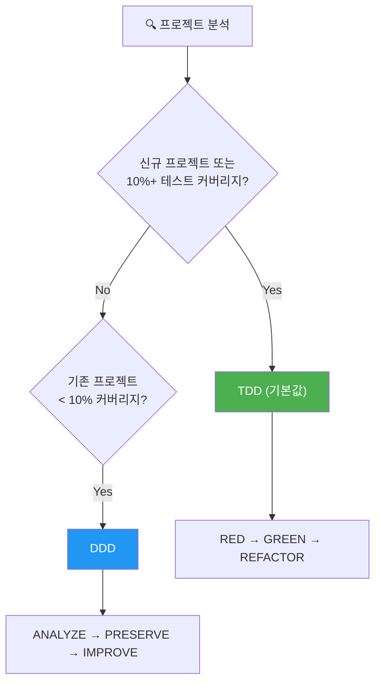
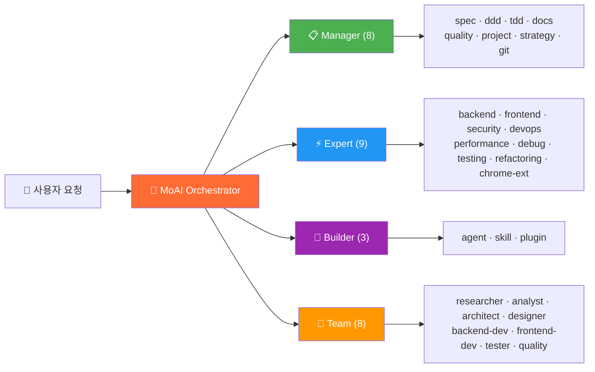
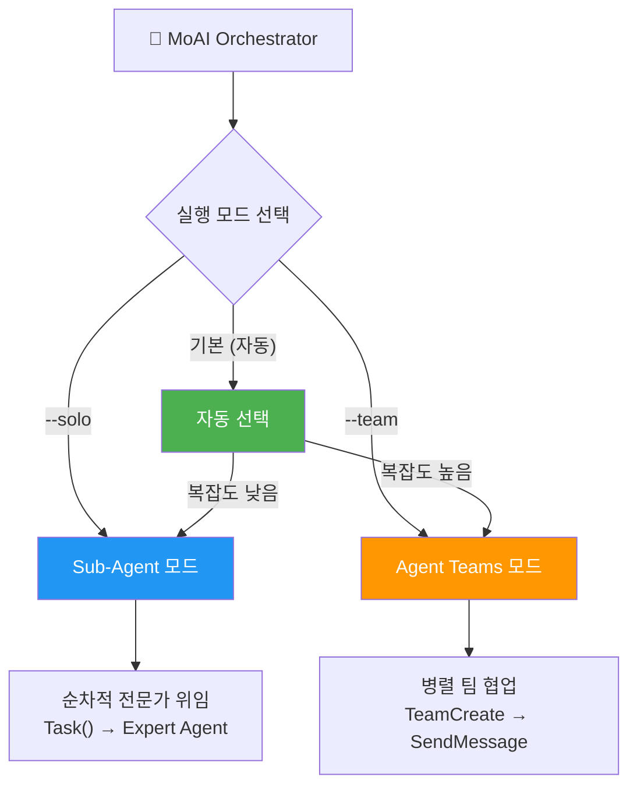
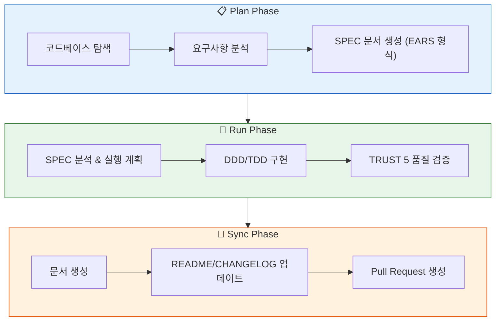

<p align="center">
  
</p>

<h1 align="center">MoAI-ADK</h1>

<p align="center">
  <strong>Claude Code를 위한 Agentic Development Kit</strong>
</p>

<p align="center">
  <a href="./README.md">English</a> ·
  <a href="./README.ko.md">한국어</a> ·
  <a href="./README.ja.md">日本語</a> ·
  <a href="./README.zh.md">中文</a>
</p>

<p align="center">
  <a href="https://github.com/modu-ai/moai-adk/actions/workflows/ci.yml"></a>
  <a href="https://github.com/modu-ai/moai-adk/actions/workflows/codeql.yml"></a>
  <a href="https://codecov.io/gh/modu-ai/moai-adk"></a>
  <br>
  <a href="https://go.dev/"></a>
  <a href="https://github.com/modu-ai/moai-adk/releases"></a>
  <a href="./LICENSE"></a>
</p>

<p align="center">
  <a href="https://adk.mo.ai.kr"><strong>Official Documentation</strong></a>
</p>

---

> 📚 **[공식 문서](https://adk.mo.ai.kr)** | **[GitHub Discussions](https://github.com/modu-ai/moai-adk/discussions)** | **[Discord 커뮤니티](https://discord.gg/moai-adk)**

---

> **"바이브 코딩의 목적은 빠른 생산성이 아니라 코드 품질이다."**

MoAI-ADK는 Claude Code를 위한 **고성능 AI 개발 환경**입니다. 28개 전문 AI 에이전트와 52개 스킬이 협력하여 품질 있는 코드를 만듭니다. 신규 프로젝트와 기능 개발에는 TDD(기본값)를, 테스트 커버리지가 낮은 기존 프로젝트에는 DDD를 자동 적용하며, Sub-Agent와 Agent Teams 이중 실행 모드를 지원합니다.

Go로 작성된 단일 바이너리 — 의존성 없이 모든 플랫폼에서 즉시 실행됩니다.

---

## 왜 MoAI-ADK인가?

Python 기반 MoAI-ADK(~73,000줄)를 Go로 완전히 재작성했습니다.

| 항목 | Python Edition | Go Edition |
|------|---------------|------------|
| 배포 | pip + venv + 의존성 | **단일 바이너리**, 의존성 없음 |
| 시작 시간 | ~800ms 인터프리터 부팅 | **~5ms** 네이티브 실행 |
| 동시성 | asyncio / threading | **네이티브 goroutines** |
| 타입 안전성 | 런타임 (mypy 선택) | **컴파일 타임 강제** |
| 크로스 플랫폼 | Python 런타임 필요 | **프리빌트 바이너리** (macOS, Linux, Windows) |
| 훅 실행 | Shell 래퍼 + Python | **컴파일된 바이너리**, JSON 프로토콜 |

### 핵심 수치

- **34,220줄** Go 코드, **32개** 패키지
- **85-100%** 테스트 커버리지
- **28개** 전문 AI 에이전트 + **52개** 스킬
- **18개** 프로그래밍 언어 지원
- **16개** Claude Code 훅 이벤트

---

## 시스템 요구사항

| 플랫폼 | 지원 환경 | 비고 |
|--------|----------|------|
| macOS | Terminal, iTerm2 | 완전 지원 |
| Linux | Bash, Zsh | 완전 지원 |
| Windows | **WSL (권장)**, PowerShell 7.x+ | 네이티브 cmd.exe 미지원 |

**필수 조건:**
- **Git**이 모든 플랫폼에서 설치되어 있어야 합니다
- **Windows 사용자**: [Git for Windows](https://gitforwindows.org/) **필수 설치** (Git Bash 포함)
  - **WSL** (Windows Subsystem for Linux) 사용을 권장합니다
  - PowerShell 7.x 이상도 지원됩니다
  - 레거시 Windows PowerShell 5.x 및 cmd.exe는 **지원하지 않습니다**

---

## 빠른 시작

### 1. 설치

#### macOS / Linux / WSL

```bash
curl -fsSL https://raw.githubusercontent.com/modu-ai/moai-adk/main/install.sh | bash
```

#### Windows (PowerShell 7.x+)

> **권장**: 최상의 경험을 위해 WSL에서 위의 Linux 설치 명령어를 사용하세요.

```powershell
irm https://raw.githubusercontent.com/modu-ai/moai-adk/main/install.ps1 | iex
```

> [Git for Windows](https://gitforwindows.org/)가 먼저 설치되어 있어야 합니다.

#### 소스에서 빌드 (Go 1.26+)

```bash
git clone https://github.com/modu-ai/moai-adk.git
cd moai-adk && make build
```

> 프리빌트 바이너리는 [Releases](https://github.com/modu-ai/moai-adk/releases) 페이지에서 다운로드할 수 있습니다.

### 2. 프로젝트 초기화

```bash
moai init my-project
```

대화형 마법사가 언어, 프레임워크, 방법론을 자동 감지하고 Claude Code 통합 파일을 생성합니다.

### 3. Claude Code에서 개발 시작

```bash
# Claude Code 실행 후
/moai project                            # 프로젝트 문서 생성 (product.md, structure.md, tech.md)
/moai plan "사용자 인증 기능 추가"        # SPEC 문서 생성
/moai run SPEC-AUTH-001                   # DDD/TDD 구현
/moai sync SPEC-AUTH-001                  # 문서 동기화 & PR 생성
```



---

## MoAI 개발 방법론

MoAI-ADK는 프로젝트 상태에 따라 최적의 개발 방법론을 자동 선택합니다.



### TDD 방법론 (기본값)

신규 프로젝트와 기능 개발에 권장되는 기본 방법론입니다. 테스트를 먼저 작성합니다.

| 단계 | 설명 |
|------|------|
| **RED** | 기대 동작을 정의하는 실패 테스트 작성 |
| **GREEN** | 테스트를 통과하는 최소 코드 작성 |
| **REFACTOR** | 테스트를 유지하면서 코드 품질 개선 |

브라운필드 프로젝트(기존 코드베이스)에서는 **RED 전 분석 단계**가 추가됩니다: 테스트 작성 전에 기존 코드를 읽어 현재 동작을 파악합니다.

### DDD 방법론 (테스트 커버리지 < 10% 기존 프로젝트)

테스트 커버리지가 최소인 기존 프로젝트에서 안전하게 리팩토링하기 위한 방법론입니다.

```
ANALYZE   → 기존 코드와 의존성 분석, 도메인 경계 식별
PRESERVE  → 특성 테스트 작성, 현재 동작 스냅샷 캡처
IMPROVE   → 테스트로 보호된 상태에서 점진적 개선
```

> 방법론은 `moai init` 시 자동 선택되며 (`--mode <ddd|tdd>`, 기본값: tdd), `.moai/config/sections/quality.yaml`의 `development_mode`에서 변경할 수 있습니다.
>
> **참고**: MoAI-ADK v2.5.0+는 이진 방법론 선택(TDD 또는 DDD만)을 사용합니다. 명확성과 일관성을 위해 hybrid 모드는 제거되었습니다.

---

## AI 에이전트 오케스트레이션

MoAI는 **전략적 오케스트레이터**입니다. 직접 코드를 작성하지 않고, 28개 전문 에이전트에게 작업을 위임합니다.



### 에이전트 카테고리

| 카테고리 | 수량 | 에이전트 | 역할 |
|----------|------|---------|------|
| **Manager** | 8 | spec, ddd, tdd, docs, quality, project, strategy, git | 워크플로우 조율, SPEC 생성, 품질 관리 |
| **Expert** | 9 | backend, frontend, security, devops, performance, debug, testing, refactoring, chrome-extension | 도메인 전문 구현, 분석, 최적화 |
| **Builder** | 3 | agent, skill, plugin | 새로운 MoAI 컴포넌트 생성 |
| **Team** | 8 | researcher, analyst, architect, designer, backend-dev, frontend-dev, tester, quality | 병렬 팀 기반 개발 |

### 52개 스킬 (프로그레시브 디스클로저)

토큰 효율을 위해 3단계 프로그레시브 디스클로저 시스템으로 관리됩니다:

| 카테고리 | 스킬 수 | 예시 |
|----------|---------|------|
| **Foundation** | 5 | core, claude, philosopher, quality, context |
| **Workflow** | 11 | spec, project, ddd, tdd, testing, worktree, thinking... |
| **Domain** | 5 | backend, frontend, database, uiux, data-formats |
| **Language** | 18 | Go, Python, TypeScript, Rust, Java, Kotlin, Swift, C++... |
| **Platform** | 9 | Vercel, Supabase, Firebase, Auth0, Clerk, Railway... |
| **Library** | 3 | shadcn, nextra, mermaid |
| **Tool** | 2 | ast-grep, svg |
| **Specialist** | 11 | Figma, Flutter, Chrome Extension, Pencil... |

---

## 모델 정책 (토큰 최적화)

MoAI-ADK는 Claude Code 구독 요금제에 맞춰 28개 에이전트에 최적의 AI 모델을 할당합니다. 요금제의 사용량 제한 내에서 품질을 극대화합니다.

| 정책 | 요금제 | 🟣 Opus | 🔵 Sonnet | 🟡 Haiku | 용도 |
|------|--------|------|--------|-------|------|
| **High** | Max $200/월 | 23 | 1 | 4 | 최고 품질, 최대 처리량 |
| **Medium** | Max $100/월 | 4 | 19 | 5 | 품질과 비용의 균형 |
| **Low** | Plus $20/월 | 0 | 12 | 16 | 경제적, Opus 미포함 |

> **왜 중요한가요?** Plus $20 요금제는 Opus를 포함하지 않습니다. `Low`로 설정하면 모든 에이전트가 Sonnet과 Haiku만 사용하여 사용량 제한 오류를 방지합니다. 상위 요금제에서는 핵심 에이전트(보안, 전략, 아키텍처)에 Opus를, 일반 작업에 Sonnet/Haiku를 배분합니다.

### 티어별 에이전트 모델 배정

#### Manager Agents

| 에이전트 | High | Medium | Low |
|---------|------|--------|-----|
| manager-spec | 🟣 opus | 🟣 opus | 🔵 sonnet |
| manager-strategy | 🟣 opus | 🟣 opus | 🔵 sonnet |
| manager-ddd | 🟣 opus | 🔵 sonnet | 🔵 sonnet |
| manager-tdd | 🟣 opus | 🔵 sonnet | 🔵 sonnet |
| manager-project | 🟣 opus | 🔵 sonnet | 🟡 haiku |
| manager-docs | 🔵 sonnet | 🟡 haiku | 🟡 haiku |
| manager-quality | 🟡 haiku | 🟡 haiku | 🟡 haiku |
| manager-git | 🟡 haiku | 🟡 haiku | 🟡 haiku |

#### Expert Agents

| 에이전트 | High | Medium | Low |
|---------|------|--------|-----|
| expert-backend | 🟣 opus | 🔵 sonnet | 🔵 sonnet |
| expert-frontend | 🟣 opus | 🔵 sonnet | 🔵 sonnet |
| expert-security | 🟣 opus | 🟣 opus | 🔵 sonnet |
| expert-debug | 🟣 opus | 🔵 sonnet | 🔵 sonnet |
| expert-refactoring | 🟣 opus | 🔵 sonnet | 🔵 sonnet |
| expert-devops | 🟣 opus | 🔵 sonnet | 🟡 haiku |
| expert-performance | 🟣 opus | 🔵 sonnet | 🟡 haiku |
| expert-testing | 🟣 opus | 🔵 sonnet | 🟡 haiku |
| expert-chrome-extension | 🟣 opus | 🔵 sonnet | 🟡 haiku |

#### Builder Agents

| 에이전트 | High | Medium | Low |
|---------|------|--------|-----|
| builder-agent | 🟣 opus | 🔵 sonnet | 🟡 haiku |
| builder-skill | 🟣 opus | 🔵 sonnet | 🟡 haiku |
| builder-plugin | 🟣 opus | 🔵 sonnet | 🟡 haiku |

#### Team Agents

| 에이전트 | High | Medium | Low |
|---------|------|--------|-----|
| team-architect | 🟣 opus | 🟣 opus | 🔵 sonnet |
| team-analyst | 🟣 opus | 🔵 sonnet | 🟡 haiku |
| team-designer | 🟣 opus | 🔵 sonnet | 🟡 haiku |
| team-backend-dev | 🟣 opus | 🔵 sonnet | 🔵 sonnet |
| team-frontend-dev | 🟣 opus | 🔵 sonnet | 🔵 sonnet |
| team-tester | 🟣 opus | 🔵 sonnet | 🟡 haiku |
| team-researcher | 🟡 haiku | 🟡 haiku | 🟡 haiku |
| team-quality | 🟡 haiku | 🟡 haiku | 🟡 haiku |

### 설정 방법

```bash
# 프로젝트 초기화 시
moai init my-project          # 대화형 마법사에서 모델 정책 선택

# 기존 프로젝트 재설정
moai update                   # 각 설정 단계별 대화형 프롬프트
```

`moai update` 실행 시 다음 항목을 묻습니다:
- **모델 정책 재설정?** (y/n) - 모델 정책 설정 마법사 재실행
- **GLM 설정 업데이트?** (y/n) - settings.local.json에 GLM 환경 변수 구성

> 기본 정책은 `High`입니다. GLM 설정은 `settings.local.json`에 격리됩니다 (Git에 커밋되지 않음).

---

## 이중 실행 모드

MoAI-ADK는 Claude Code가 지원하는 **Sub-Agent**와 **Agent Teams** 두 가지 실행 모드를 모두 제공합니다.



### Agent Teams 모드 (기본값)

MoAI-ADK는 프로젝트 복잡도를 자동으로 분석하여 최적의 실행 모드를 선택합니다:

| 조건 | 선택 모드 | 이유 |
|------|-----------|------|
| 도메인 3개 이상 | Agent Teams | 멀티 도메인 조율 |
| 영향 파일 10개 이상 | Agent Teams | 대규모 변경 |
| 복잡도 점수 7 이상 | Agent Teams | 높은 복잡도 |
| 그 외 | Sub-Agent | 단순하고 예측 가능한 워크플로우 |

**Agent Teams 모드**는 병렬 팀 기반 개발을 사용합니다:

- 여러 에이전트가 동시에 작업하고 공유 작업 목록으로 협업
- `TeamCreate`, `SendMessage`, `TaskList`를 통한 실시간 조율
- 대규모 기능 개발, 멀티 도메인 작업에 적합

```bash
/moai plan "대규모 기능"          # 자동: researcher + analyst + architect 병렬
/moai run SPEC-XXX                # 자동: backend-dev + frontend-dev + tester 병렬
/moai run SPEC-XXX --team         # Agent Teams 모드 강제
```

**Agent Teams용 품질 훅:**
- **TeammateIdle 훅**: 팀원이 대기 상태로 전환되기 전 LSP 품질 게이트 검증 (에러, 타입 에러, 린트 에러)
- **TaskCompleted 훅**: 작업이 SPEC-XXX 패턴을 참조할 때 SPEC 문서 존재 확인
- 모든 검증은 graceful degradation 사용 - 경고는 로그되지만 작업은 계속됨

### Sub-Agent 모드 (`--solo`)

기존 Claude Code의 `Task()` API를 활용한 순차적 에이전트 위임 방식입니다.

- 하나의 전문 에이전트에게 작업을 위임하고 결과를 받음
- 단계별로 Manager → Expert → Quality 순서로 진행
- 단순하고 예측 가능한 워크플로우에 적합

```bash
/moai run SPEC-AUTH-001 --solo    # Sub-Agent 모드 강제
```

---

## MoAI 워크플로우

### Plan → Run → Sync 파이프라인

MoAI의 핵심 워크플로우는 3단계로 구성됩니다:



### /moai 서브커맨드

모든 서브커맨드는 Claude Code 내에서 `/moai <서브커맨드>`로 실행합니다.

#### 핵심 워크플로우

| 서브커맨드 | 별칭 | 목적 | 주요 플래그 |
|-----------|------|------|------------|
| `plan` | `spec` | SPEC 문서 생성 (EARS 형식) | `--worktree`, `--branch`, `--resume SPEC-XXX`, `--team` |
| `run` | `impl` | SPEC의 DDD/TDD 구현 | `--resume SPEC-XXX`, `--team` |
| `sync` | `docs`, `pr` | 문서 동기화, 코드맵 업데이트, PR 생성 | `--merge`, `--skip-mx` |

#### 품질 & 테스팅

| 서브커맨드 | 별칭 | 목적 | 주요 플래그 |
|-----------|------|------|------------|
| `fix` | — | LSP 에러, 린트, 타입 에러 자동 수정 (단일 패스) | `--dry`, `--seq`, `--level N`, `--resume`, `--team` |
| `loop` | — | 완료까지 반복 자동 수정 (최대 100회) | `--max N`, `--auto-fix`, `--seq` |
| `review` | `code-review` | 보안 및 @MX 태그 준수 코드 리뷰 | `--staged`, `--branch`, `--security` |
| `coverage` | `test-coverage` | 테스트 커버리지 분석 및 갭 보완 (16개 언어) | `--target N`, `--file PATH`, `--report` |
| `e2e` | — | E2E 테스트 (Claude-in-Chrome, Playwright CLI, Agent Browser) | `--record`, `--url URL`, `--journey NAME` |
| `clean` | `refactor-clean` | 데드 코드 식별 및 안전한 제거 | `--dry`, `--safe-only`, `--file PATH` |

#### 문서 & 코드베이스

| 서브커맨드 | 별칭 | 목적 | 주요 플래그 |
|-----------|------|------|------------|
| `project` | `init` | 프로젝트 문서 생성 (product.md, structure.md, tech.md, .moai/project/codemaps/) | — |
| `mx` | — | 코드베이스 스캔 및 @MX 코드 레벨 주석 추가 | `--all`, `--dry`, `--priority P1-P4`, `--force`, `--team` |
| `codemaps` | `update-codemaps` | `.moai/project/codemaps/`에 아키텍처 문서 생성 | `--force`, `--area AREA` |
| `feedback` | `fb`, `bug`, `issue` | 사용자 피드백 수집 및 GitHub 이슈 생성 | — |

#### 기본 워크플로우

| 서브커맨드 | 목적 | 주요 플래그 |
|-----------|------|------------|
| *(없음)* | 완전 자율 plan → run → sync 파이프라인. 복잡도 점수 >= 5일 때 SPEC 자동 생성. | `--loop`, `--max N`, `--branch`, `--pr`, `--resume SPEC-XXX`, `--team`, `--solo` |

### 실행 모드 플래그

워크플로우 실행 시 에이전트 디스패치 방식을 제어합니다:

| 플래그 | 모드 | 설명 |
|--------|------|------|
| `--team` | Agent Teams | 병렬 팀 기반 실행. 여러 에이전트가 동시 작업. |
| `--solo` | Sub-Agent | 페이즈별 순차 단일 에이전트 위임. |
| *(기본)* | 자동 | 복잡도 기반 자동 선택 (도메인 >= 3, 파일 >= 10, 점수 >= 7). |

**`--team`은 세 가지 실행 환경을 지원합니다:**

| 환경 | 명령어 | 리더 | 워커 | 용도 |
|------|--------|------|------|------|
| Claude 전용 | `moai cc` | Claude | Claude | 최고 품질 |
| GLM 전용 | `moai glm` | GLM | GLM | 최대 비용 절감 |
| CG (Claude+GLM) | `moai cg` | Claude | GLM | 품질 + 비용 균형 |

> **참고**: `moai cg`는 tmux pane 레벨 환경 격리를 사용하여 Claude 리더와 GLM 워커를 분리합니다. `moai glm` 모드에서 전환 시, `moai cg`가 GLM 설정을 자동으로 리셋합니다 — 중간에 `moai cc`를 실행할 필요 없습니다.

### 자율 개발 루프 (Ralph Engine)

LSP 진단과 AST-grep을 결합한 자율 에러 수정 엔진입니다:

```bash
/moai fix       # 단일 패스: 스캔 → 분류 → 수정 → 검증
/moai loop      # 반복 수정: 완료 마커 감지까지 반복 (최대 100회)
```

**Ralph Engine 동작:**
1. **병렬 스캔**: LSP 진단 + AST-grep + 린터를 동시 실행
2. **자동 분류**: 에러를 Level 1(자동 수정) ~ Level 4(사용자 개입)로 분류
3. **수렴 감지**: 동일 에러 반복 시 대체 전략 적용
4. **완료 조건**: 0 에러, 0 타입 에러, 85%+ 커버리지

### 권장 워크플로우 체인

**신규 기능 개발:**
```
/moai plan → /moai run SPEC-XXX → /moai review → /moai coverage → /moai sync SPEC-XXX
```

**버그 수정:**
```
/moai fix (또는 /moai loop) → /moai review → /moai sync
```

**리팩토링:**
```
/moai plan → /moai clean → /moai run SPEC-XXX → /moai review → /moai coverage → /moai codemaps
```

**문서 업데이트:**
```
/moai codemaps → /moai sync
```

---

## TRUST 5 품질 프레임워크

모든 코드 변경은 5가지 품질 기준으로 검증됩니다:

| 기준 | 설명 | 검증 항목 |
|------|------|-----------|
| **T**ested | 테스트됨 | 85%+ 커버리지, 특성 테스트, 유닛 테스트 통과 |
| **R**eadable | 읽기 쉬움 | 명확한 명명 규칙, 일관된 코드 스타일, 린트 오류 0 |
| **U**nified | 통일됨 | 일관된 포맷팅, 임포트 순서, 프로젝트 구조 준수 |
| **S**ecured | 안전함 | OWASP 준수, 입력 검증, 보안 경고 0 |
| **T**rackable | 추적 가능 | 컨벤셔널 커밋, 이슈 참조, 구조화된 로그 |

---

## Task 메트릭 로깅

MoAI-ADK는 개발 세션 중 Task 도구 메트릭을 자동으로 캡처합니다:

- **위치**: `.moai/logs/task-metrics.jsonl`
- **캡처 메트릭**: 토큰 사용량, 도구 호출, 소요 시간, 에이전트 타입
- **목적**: 세션 분석, 성능 최적화, 비용 추적

Task 도구 완료 시 PostToolUse 훅이 메트릭을 로깅합니다. 이 데이터를 사용하여 에이전트 효율성을 분석하고 토큰 소비를 최적화하세요.

---

## CLI 명령어

| 명령어 | 설명 |
|--------|------|
| `moai init` | 대화형 프로젝트 설정 (언어/프레임워크/방법론 자동 감지) |
| `moai doctor` | 시스템 상태 진단 및 환경 검증 |
| `moai status` | Git 브랜치, 품질 메트릭 등 프로젝트 상태 요약 |
| `moai update` | 최신 버전으로 업데이트 (자동 롤백 지원) |
| `moai update --check` | 설치 없이 업데이트 확인 |
| `moai update --project` | 프로젝트 템플릿만 동기화 |
| `moai worktree new <name>` | 새 Git worktree 생성 (병렬 브랜치 개발) |
| `moai worktree list` | 활성 worktree 목록 |
| `moai worktree switch <name>` | worktree 전환 |
| `moai worktree sync` | 업스트림과 동기화 |
| `moai worktree remove <name>` | worktree 제거 |
| `moai worktree clean` | 오래된 worktree 정리 |
| `moai worktree go <name>` | 현재 셸에서 worktree 디렉토리로 이동 |
| `moai hook <event>` | Claude Code 훅 디스패처 |
| `moai glm` | GLM 5 API로 Claude Code 시작 (비용 효율적 대안) |
| `moai cc` | GLM 설정 없이 Claude Code 시작 (Claude 전용 모드) |
| `moai cg` | CG 모드 활성화 — Claude 리더 + GLM 팀원 (tmux pane 레벨 격리) |
| `moai version` | 버전, 커밋 해시, 빌드 날짜 정보 |

---

## 아키텍처

```
moai-adk/
├── cmd/moai/             # 애플리케이션 진입점
├── internal/             # 핵심 프라이빗 패키지
│   ├── astgrep/          # AST-grep 통합
│   ├── cli/              # Cobra CLI 명령어 정의
│   ├── config/           # 스레드 안전 YAML 구성 관리
│   ├── core/
│   │   ├── git/          # Git 작업 (브랜치, worktree, 충돌 감지)
│   │   ├── project/      # 프로젝트 초기화, 언어/프레임워크 감지
│   │   └── quality/      # TRUST 5 품질 게이트, 병렬 검증기
│   ├── defs/             # 언어 정의 및 프레임워크 감지
│   ├── git/              # Git 컨벤션 검증 엔진
│   ├── hook/             # 컴파일된 훅 시스템 (16개 이벤트, JSON 프로토콜)
│   ├── loop/             # Ralph 피드백 루프 (상태 머신, 수렴 감지)
│   ├── lsp/              # LSP 클라이언트 (16개+ 언어, 병렬 서버 관리)
│   ├── manifest/         # 파일 출적 추적 (SHA-256 무결성)
│   ├── merge/            # 3-way 병합 엔진 (6가지 전략)
│   ├── rank/             # MoAI Rank 동기화 및 트랜스크립트 관리
│   ├── resilience/       # 재시도 정책 및 서킷 브레이커
│   ├── shell/            # 셸 통합 (worktree 내비게이션)
│   ├── statusline/       # Claude Code 상태줄 통합
│   ├── template/         # 템플릿 배포 (go:embed), 설정 생성
│   ├── ui/               # 대화형 TUI (선택기, 체크박스, 마법사)
│   └── update/           # 바이너리 자체 업데이트 메커니즘
├── pkg/                  # 퍼블릭 라이브러리 패키지
│   ├── models/           # 공유 데이터 모델
│   └── version/          # 빌드 버전 메타데이터
└── Makefile              # 빌드 자동화
```

### 주요 패키지 커버리지

| 패키지 | 목적 | 커버리지 |
|--------|------|----------|
| `foundation` | EARS 패턴, TRUST 5, 18개 언어 정의 | 98.4% |
| `core/quality` | 병렬 검증기, 페이즈 게이트 | 96.8% |
| `ui` | 대화형 TUI 컴포넌트 | 96.8% |
| `config` | 스레드 안전 YAML 구성 | 94.1% |
| `loop` | Ralph 피드백 루프, 수렴 감지 | 92.7% |
| `cli` | Cobra 명령어 | 92.0% |
| `ralph` | 수렴 결정 엔진 | 100% |
| `statusline` | Claude Code 상태줄 | 100% |

---

## 스폰서

### z.ai GLM 5

MoAI-ADK는 **z.ai GLM 5**과 파트너십을 통해 경제적인 AI 개발 환경을 제공합니다.

| 혜택 | 설명 |
|------|------|
| 70% 비용 절감 | Claude 대비 1/7 가격으로 동등한 성능 |
| 완벽 호환 | Claude Code와 코드 수정 없이 사용 가능 |
| 무제한 사용 | 일간/주간 토큰 리밋 없이 자유롭게 사용 |

**[GLM 5 가입하기 (10% 추가 할인)](https://z.ai/subscribe?ic=1NDV03BGWU)** — 가입 리워드는 MoAI 오픈소스 개발에 사용됩니다.

### CG 모드 (Claude + GLM 하이브리드)

CG 모드는 Leader는 **Claude API**, Workers는 **GLM API**를 사용하는 하이브리드 모드입니다. tmux session-level 환경변수를 활용한 pane 격리로 구현됩니다.

#### 작동 원리

```
moai cg 실행
    │
    ├── 1. tmux session env에 GLM 설정 주입
    │      (ANTHROPIC_AUTH_TOKEN, BASE_URL, MODEL_* 변수)
    │
    ├── 2. settings.local.json에서 GLM env 제거
    │      → Leader pane은 Claude API 사용
    │
    └── 3. CLAUDE_CODE_TEAMMATE_DISPLAY=tmux 설정
           → Workers는 새 pane에서 GLM env 상속

┌─────────────────────────────────────────────────────────────┐
│  LEADER (현재 tmux pane, Claude API)                        │
│  - /moai --team 실행 시 워크플로우 조율                       │
│  - plan, quality, sync 단계 수행                             │
│  - GLM env 없음 → Claude API 사용                            │
└──────────────────────┬──────────────────────────────────────┘
                       │ Agent Teams (새 tmux panes)
                       ▼
┌─────────────────────────────────────────────────────────────┐
│  TEAMMATES (새 tmux panes, GLM API)                         │
│  - tmux session env 상속 → GLM API 사용                      │
│  - run 단계의 구현 작업 수행                                  │
│  - SendMessage으로 리더와 통신                               │
└─────────────────────────────────────────────────────────────┘
```

#### 사용 방법

```bash
# 1. GLM API 키 저장 (최초 1회)
moai glm sk-your-glm-api-key

# 2. tmux 세션 확인 (이미 tmux 사용 중이면 생략)
# 새 tmux 세션이 필요한 경우:
tmux new -s moai

# VS Code 터미널 설정에서 "기본 실행 터미널"을 tmux로 설정하면
# 자동으로 tmux 환경에서 시작되어 이 단계를 생략할 수 있습니다.

# 3. CG 모드 활성화
moai cg

# 4. 같은 pane에서 Claude Code 시작 (중요!)
claude

# 5. Team 작업 실행
/moai --team "작업 설명"
```

#### 주의사항

| 항목 | 설명 |
|------|------|
| **tmux 환경** | 이미 tmux를 사용 중인 터미널에서는 새 세션 생성 불필요. VS Code 터미널 기본값을 tmux로 설정하면 편리. |
| **Leader 시작 위치** | 반드시 `moai cg`를 실행한 **같은 pane**에서 Claude Code 시작. 새 pane에서 시작하면 GLM env를 상속받음. |
| **세션 종료 시** | session_end hook이 tmux session env를 자동 제거 → 다음 세션에서 Claude로 복귀 |
| **Agent Teams 통신** | SendMessage 도구로 Leader↔Workers 통신 가능 |

#### 모드 비교

| 명령어 | Leader | Workers | tmux 필요 | 비용 절감 | 사용 시나리오 |
|--------|--------|---------|-----------|-----------|---------------|
| `moai cc` | Claude | Claude | 아니오 | - | 복잡한 작업, 최고 품질 |
| `moai glm` | GLM | GLM | 권장 | ~70% | 비용 최적화 |
| `moai cg` | Claude | GLM | **필수** | **~60%** | 품질 + 비용 균형 |

#### Display 모드

Agent Teams는 두 가지 display 모드를 지원합니다:

| 모드 | 설명 | 통신 | Leader/Worker 분리 |
|------|------|------|-------------------|
| `in-process` | 기본 모드, 모든 터미널 | ✅ SendMessage | ❌ 동일 env |
| `tmux` | split-pane 표시 | ✅ SendMessage | ✅ session env 분리 |

**CG 모드는 `tmux` display 모드에서만 Leader/Worker API 분리가 가능합니다.**

---

## @MX 태그 시스템

MoAI-ADK는 **@MX 코드 레벨 주석 시스템**을 사용하여 AI 에이전트 간 컨텍스트, 불변 계약, 위험 영역을 전달합니다.

### @MX 태그란 무엇인가요?

@MX 태그는 코드에 직접 추가하는 주석으로, AI 에이전트가 코드베이스를 더 빠르고 정확하게 이해할 수 있게 돕습니다.

```go
// @MX:ANCHOR: [AUTO] 훅 레지스트리 디스패치 - 5개 이상의 호출자
// @MX:REASON: [AUTO] 모든 훅 이벤트의 중앙 진입점이므로 변경 시 영향 범위 큼
func DispatchHook(event string, data []byte) error {
    // ...
}

// @MX:WARN: [AUTO] Goroutine이 context.Context 없이 실행됨
// @MX:REASON: [AUTO] 컨텍스트 취소가 불가능하여 리소스 누수 위험
func processAsync() {
    go func() {
        // ...
    }()
}
```

### 태그 유형

| 태그 타입 | 용도 | 설명 |
|----------|------|------|
| `@MX:ANCHOR` | 중요 계약 | fan_in >= 3인 함수, 변경 시 영향 범위 큼 |
| `@MX:WARN` | 위험 영역 | Goroutine, 복잡도 >= 15, 전역 상태 변이 |
| `@MX:NOTE` | 컨텍스트 | 마법 상수, 누락된 godoc, 비즈니스 규칙 |
| `@MX:TODO` | 미완성 작업 | 누락된 테스트, 구현되지 않은 기능 |

### 왜 모든 코드에 @MX 태그가 없나요?

@MX 태그 시스템은 **"모든 코드에 태그를 추가하는 것"이 목적이 아닙니다.** 핵심은 **"AI가 가장 먼저 주목해야 할 위험/중요 코드만 표시"**하는 것입니다.

| 우선순위 | 조건 | 태그 타입 |
|----------|------|----------|
| **P1 (Critical)** | fan_in >= 3 | `@MX:ANCHOR` |
| **P2 (Danger)** | goroutine, complexity >= 15 | `@MX:WARN` |
| **P3 (Context)** | magic constant, no godoc | `@MX:NOTE` |
| **P4 (Missing)** | no test file | `@MX:TODO` |

**대부분의 코드는 아무 조건도 만족하지 못해 태그가 없습니다.** 이것이 **정상**입니다.

### 예시: 태그 유무 결정

```go
// ❌ 태그 없음 (fan_in = 1, 복잡도 낮음)
func calculateTotal(items []Item) int {
    total := 0
    for _, item := range items {
        total += item.Price
    }
    return total
}

// ✅ @MX:ANCHOR 추가 (fan_in = 5)
// @MX:ANCHOR: [AUTO] 설정 관리자 로드 - 5개 이상의 호출자
// @MX:REASON: [AUTO] 모든 CLI 명령어의 설정 진입점
func LoadConfig() (*Config, error) {
    // ...
}
```

### 설정 (`.moai/config/sections/mx.yaml`)

```yaml
thresholds:
  fan_in_anchor: 3        # 3개 미만 호출자 = ANCHOR 없음
  complexity_warn: 15     # 복잡도 15 미만 = WARN 없음
  branch_warn: 8          # 분기 8개 미만 = WARN 없음

limits:
  anchor_per_file: 3      # 파일당 최대 3개 ANCHOR
  warn_per_file: 5        # 파일당 최대 5개 WARN

exclude:
  - "**/*_generated.go"   # 생성된 파일 제외
  - "**/vendor/**"        # 외부 라이브러리 제외
  - "**/mock_*.go"        # 목 파일 제외
```

### MX 태그 스캔 실행

```bash
# 전체 코드베이스 스캔 (Go 프로젝트)
/moai mx --all

# 미리보기만 (파일 수정 없음)
/moai mx --dry

# 우선순위별 스캔 (P1만)
/moai mx --priority P1

# 특정 언어만 스캔
/moai mx --all --lang go,python
```

### 다른 프로젝트에서도 MX 태그가 적은 이유

| 상황 | 이유 |
|------|------|
| **신규 프로젝트** | fan_in이 0인 함수들이 대부분 → 태그 없음 (정상) |
| **작은 프로젝트** | 함수 개수 적음 = 호출 관계 단순 = 태그 적음 |
| **높은 품질 코드** | 복잡도 낮음, goroutine 없음 → WARN 없음 |
| **높은 임계값 설정** | `fan_in_anchor: 5`로 설정되면 태그 더 적음 |

### 핵심 원칙

MX 태그 시스템은 **"신호 대 잡음비(Signal-to-Noise Ratio)"**를 최적화하는 것을 목표로 합니다:

- ✅ **정말 중요한 코드만 표시** → AI가 핵심을 빠르게 파악
- ❌ **모든 코드에 태그 추가** → 노이즈 증가, 오히려 중요 태그 찾기 어려움

---

## 자주 묻는 질문 (FAQ)

### Q: 왜 모든 Go 코드에 @MX 태그가 없나요?

**A: 이것이 정상입니다.** @MX 태그는 "필요한 코드에만" 추가됩니다. 대부분의 코드는 충분히 단순하고 안전해서 태그가 필요 없습니다.

| 질문 | 답변 |
|------|------|
| 태그가 없는 건 문제인가? | **아닙니다.** 대부분의 코드는 태그가 필요 없습니다. |
| 언제 태그가 추가되나? | **높은 fan_in**, **복잡한 로직**, **위험 패턴**이 있을 때만 |
| 모든 프로젝트가 비슷한가? | **네.** 모든 프로젝트에서 대부분의 코드는 태그가 없습니다. |

자세한 내용은 위의 **"@MX 태그 시스템"** 섹션을 참조하세요.

---

### Q: statusline의 버전 표시는 무엇을 의미하나요?

MoAI statusline은 버전 정보와 업데이트 알림을 함께 표시합니다:

```
🗿 v2.2.2 ⬆️ v2.2.5
```

- **`v2.2.2`**: 현재 설치된 버전
- **`⬆️ v2.2.5`**: 업데이트 가능한 새 버전

최신 버전을 사용 중일 때는 버전 번호만 표시됩니다:
```
🗿 v2.2.5
```

**업데이트 방법**: `moai update` 실행 시 업데이트 알림이 사라집니다.

**참고**: Claude Code의 빌트인 버전 표시(`🔅 v2.1.38`)와는 다릅니다. MoAI 표시는 MoAI-ADK 버전을 추적하며, Claude Code는 자체 버전을 별도로 표시합니다.

---

### Q: statusline 세그먼트를 어떻게 커스터마이징하나요?

Statusline은 4가지 디스플레이 프리셋과 커스텀 설정을 지원합니다:

- **Full** (기본값): 8개 세그먼트 모두 표시
- **Compact**: Model + Context + Git Status + Branch만
- **Minimal**: Model + Context만
- **Custom**: 개별 세그먼트 선택

`moai init` / `moai update` 마법사에서 설정하거나 (statusline 재설정에 "y" 답변), `.moai/config/sections/statusline.yaml`을 직접 편집하세요:

```yaml
statusline:
  preset: compact  # 또는 full, minimal, custom
  segments:
    model: true
    context: true
    output_style: false
    directory: false
    git_status: true
    claude_version: false
    moai_version: false
    git_branch: true
```

자세한 내용은 [SPEC-STATUSLINE-001](.moai/specs/SPEC-STATUSLINE-001/spec.md)을 참조하세요.

---

### Q: "Allow external CLAUDE.md file imports?" 경고가 나타납니다

프로젝트를 열 때 Claude Code가 외부 파일 import에 대한 보안 프롬프트를 표시할 수 있습니다:

```
External imports:
  /Users/<user>/.moai/config/sections/quality.yaml
  /Users/<user>/.moai/config/sections/user.yaml
  /Users/<user>/.moai/config/sections/language.yaml
```

**권장 조치**: **"No, disable external imports"** 선택 ✅

**이유:**
- 프로젝트의 `.moai/config/sections/`에 이미 이 파일들이 존재합니다
- 프로젝트별 설정이 전역 설정보다 우선 적용됩니다
- 필수 설정은 이미 CLAUDE.md 텍스트에 포함되어 있습니다
- 외부 import를 비활성화하는 것이 더 안전하며 기능에 영향을 주지 않습니다

**파일 설명:**
- `quality.yaml`: TRUST 5 프레임워크 및 개발 방법론 설정
- `language.yaml`: 언어 설정 (대화, 코멘트, 커밋)
- `user.yaml`: 사용자 이름 (선택 사항, Co-Authored-By 표시용)

---

## 기여

기여를 환영합니다! 자세한 가이드는 [CONTRIBUTING.ko.md](CONTRIBUTING.ko.md)를 참조하세요.

### 빠른 시작

1. 저장소를 포크하세요
2. 기능 브랜치 생성: `git checkout -b feature/my-feature`
3. 테스트 작성 (새 코드는 TDD, 기존 코드는 특성 테스트)
4. 모든 테스트 통과 확인: `make test`
5. 린팅 통과 확인: `make lint`
6. 코드 포맷팅: `make fmt`
7. 컨벤셔널 커밋 메시지로 커밋
8. 풀 리퀘스트 오픈

**코드 품질 요구사항**: 85%+ 커버리지 · 0 린트 오류 · 0 타입 오류 · 컨벤셔널 커밋

### 커뮤니티

- [GitHub Discussions](https://github.com/modu-ai/moai-adk/discussions) — 질문, 아이디어, 피드백
- [Issues](https://github.com/modu-ai/moai-adk/issues) — 버그 리포트, 기능 요청

---

## Star History

[](https://www.star-history.com/#modu-ai/moai-adk&type=date&legend=top-left)

---

## 라이선스

[Copyleft 3.0](./LICENSE) — 자세한 내용은 LICENSE 파일을 참조하세요.

## 관련 링크

- [공식 문서](https://adk.mo.ai.kr)
- [Claude Code](https://docs.anthropic.com/en/docs/claude-code)
- [GitHub Discussions](https://github.com/modu-ai/moai-adk/discussions) — 질문, 아이디어, 커뮤니티
- [Discord 커뮤니티](https://discord.gg/moai-adk) — 실시간 소통, 팁 공유
