```mermaid
graph LR
    A["🔍 /moai project"] --> B["📋 /moai plan"]
    B -->|"SPEC Document"| C["🔨 /moai run"]
    C -->|"Implementation Complete"| D["📄 /moai sync"]
    D -->|"PR Created"| E["✅ Done"]
```

<p align="center">
  
</p>

<h1 align="center">MoAI-ADK</h1>

<p align="center">
  <strong>Agentic Development Kit for Claude Code</strong>
</p>

<p align="center">
  <a href="./README.md">English</a> ·
  <a href="./README.ko.md">한국어</a> ·
  <a href="./README.ja.md">日本語</a> ·
  <a href="./README.zh.md">中文</a>
</p>

<p align="center">
  <a href="https://github.com/modu-ai/moai-adk/actions/workflows/ci.yml"></a>
  <a href="https://github.com/modu-ai/moai-adk/actions/workflows/codeql.yml"></a>
  <a href="https://codecov.io/gh/modu-ai/moai-adk"></a>
  <br>
  <a href="https://go.dev/"></a>
  <a href="https://github.com/modu-ai/moai-adk/releases"></a>
  <a href="./LICENSE"></a>
</p>

<p align="center">
  <a href="https://adk.mo.ai.kr"><strong>Official Documentation</strong></a>
</p>

---

> 📚 **[Official Documentation](https://adk.mo.ai.kr)** | **[GitHub Discussions](https://github.com/modu-ai/moai-adk/discussions)** | **[Discord Community](https://discord.gg/moai-adk)**

---

> **"The purpose of vibe coding is not rapid productivity but code quality."**

MoAI-ADK is a **high-performance AI development environment** for Claude Code. 28 specialized AI agents and 52 skills collaborate to produce quality code. It automatically applies TDD (default) for new projects and feature development, or DDD for existing projects with minimal test coverage, and supports dual execution modes with Sub-Agent and Agent Teams.

A single binary written in Go -- runs instantly on any platform with zero dependencies.

---

## Why MoAI-ADK?

We completely rewrote the Python-based MoAI-ADK (~73,000 lines) in Go.

| Aspect | Python Edition | Go Edition |
|--------|---------------|------------|
| Distribution | pip + venv + dependencies | **Single binary**, zero dependencies |
| Startup time | ~800ms interpreter boot | **~5ms** native execution |
| Concurrency | asyncio / threading | **Native goroutines** |
| Type safety | Runtime (mypy optional) | **Compile-time enforced** |
| Cross-platform | Python runtime required | **Prebuilt binaries** (macOS, Linux, Windows) |
| Hook execution | Shell wrapper + Python | **Compiled binary**, JSON protocol |

### Key Numbers

- **34,220 lines** of Go code, **32** packages
- **85-100%** test coverage
- **28** specialized AI agents + **52** skills
- **18** programming languages supported
- **16** Claude Code hook events

---

## System Requirements

| Platform | Supported Environments | Notes |
|----------|----------------------|-------|
| macOS | Terminal, iTerm2 | Fully supported |
| Linux | Bash, Zsh | Fully supported |
| Windows | **WSL (recommended)**, PowerShell 7.x+ | Native cmd.exe is not supported |

**Prerequisites:**
- **Git** must be installed on all platforms
- **Windows users**: [Git for Windows](https://gitforwindows.org/) is **required** (includes Git Bash)
  - Use **WSL** (Windows Subsystem for Linux) for the best experience
  - PowerShell 7.x or later is supported as an alternative
  - Legacy Windows PowerShell 5.x and cmd.exe are **not supported**

---

## Quick Start

### 1. Installation

#### macOS / Linux / WSL

```bash
curl -fsSL https://raw.githubusercontent.com/modu-ai/moai-adk/main/install.sh | bash
```

#### Windows (PowerShell 7.x+)

> **Recommended**: Use WSL with the Linux installation command above for the best experience.

```powershell
irm https://raw.githubusercontent.com/modu-ai/moai-adk/main/install.ps1 | iex
```

> Requires [Git for Windows](https://gitforwindows.org/) to be installed first.

#### Build from Source (Go 1.26+)

```bash
git clone https://github.com/modu-ai/moai-adk.git
cd moai-adk && make build
```

> Prebuilt binaries are available on the [Releases](https://github.com/modu-ai/moai-adk/releases) page.

### 2. Initialize a Project

```bash
moai init my-project
```

An interactive wizard auto-detects your language, framework, and methodology, then generates Claude Code integration files.

### 3. Start Developing with Claude Code

```bash
# After launching Claude Code
/moai project                            # Generate project docs (product.md, structure.md, tech.md)
/moai plan "Add user authentication"     # Create a SPEC document
/moai run SPEC-AUTH-001                   # DDD/TDD implementation
/moai sync SPEC-AUTH-001                  # Sync docs & create PR
```



---

## MoAI Development Methodology

MoAI-ADK automatically selects the optimal development methodology based on your project's state.


### TDD Methodology (Default)

The default methodology for new projects and feature development. Write tests first, then implement.

| Phase | Description |
|-------|-------------|
| **RED** | Write a failing test that defines expected behavior |
| **GREEN** | Write minimal code to make the test pass |
| **REFACTOR** | Improve code quality while keeping tests green |

For brownfield projects (existing codebases), TDD is enhanced with a **pre-RED analysis step**: read existing code to understand current behavior before writing tests.

### DDD Methodology (Existing Projects with < 10% Coverage)

A methodology for safely refactoring existing projects with minimal test coverage.

```
ANALYZE   → Analyze existing code and dependencies, identify domain boundaries
PRESERVE  → Write characterization tests, capture current behavior snapshots
IMPROVE   → Improve incrementally under test protection
```

> The methodology is automatically selected during `moai init` (`--mode <ddd|tdd>`, default: tdd) and can be changed via `development_mode` in `.moai/config/sections/quality.yaml`.
>
> **Note**: MoAI-ADK v2.5.0+ uses binary methodology selection (TDD or DDD only). The hybrid mode has been removed for clarity and consistency.

---

## AI Agent Orchestration

MoAI is a **strategic orchestrator**. Rather than writing code directly, it delegates tasks to 28 specialized agents.

```mermaid
graph LR
    U["👤 User Request"] --> M["🗿 MoAI Orchestrator"]

    M --> MG["📋 Manager (8)"]
    M --> EX["⚡ Expert (9)"]
    M --> BL["🔧 Builder (3)"]
    M --> TM["👥 Team (8)"]

    MG --> MG1["spec · ddd · tdd · docs<br/>quality · project · strategy · git"]
    EX --> EX1["backend · frontend · security · devops<br/>performance · debug · testing · refactoring · chrome-ext"]
    BL --> BL1["agent · skill · plugin"]
    TM --> TM1["researcher · analyst · architect · designer<br/>backend-dev · frontend-dev · tester · quality"]

    style M fill:#FF6B35,color:#fff
    style MG fill:#4CAF50,color:#fff
    style EX fill:#2196F3,color:#fff
    style BL fill:#9C27B0,color:#fff
    style TM fill:#FF9800,color:#fff
```



### Agent Categories

| Category | Count | Agents | Role |
|----------|-------|--------|------|
| **Manager** | 8 | spec, ddd, tdd, docs, quality, project, strategy, git | Workflow coordination, SPEC creation, quality management |
| **Expert** | 9 | backend, frontend, security, devops, performance, debug, testing, refactoring, chrome-extension | Domain-specific implementation, analysis, optimization |
| **Builder** | 3 | agent, skill, plugin | Creating new MoAI components |
| **Team** | 8 | researcher, analyst, architect, designer, backend-dev, frontend-dev, tester, quality | Parallel team-based development |

### 52 Skills (Progressive Disclosure)

Managed through a 3-level progressive disclosure system for token efficiency:

| Category | Count | Examples |
|----------|-------|----------|
| **Foundation** | 5 | core, claude, philosopher, quality, context |
| **Workflow** | 11 | spec, project, ddd, tdd, testing, worktree, thinking... |
| **Domain** | 5 | backend, frontend, database, uiux, data-formats |
| **Language** | 18 | Go, Python, TypeScript, Rust, Java, Kotlin, Swift, C++... |
| **Platform** | 9 | Vercel, Supabase, Firebase, Auth0, Clerk, Railway... |
| **Library** | 3 | shadcn, nextra, mermaid |
| **Tool** | 2 | ast-grep, svg |
| **Specialist** | 11 | Figma, Flutter, Chrome Extension, Pencil... |

---

## Model Policy (Token Optimization)

MoAI-ADK assigns optimal AI models to each of 28 agents based on your Claude Code subscription plan. This maximizes quality within your plan's rate limits.

| Policy | Plan | 🟣 Opus | 🔵 Sonnet | 🟡 Haiku | Best For |
|--------|------|------|--------|-------|----------|
| **High** | Max $200/mo | 23 | 1 | 4 | Maximum quality, highest throughput |
| **Medium** | Max $100/mo | 4 | 19 | 5 | Balanced quality and cost |
| **Low** | Plus $20/mo | 0 | 12 | 16 | Budget-friendly, no Opus access |

> **Why does this matter?** The Plus $20 plan does not include Opus access. Setting `Low` ensures all agents use only Sonnet and Haiku, preventing rate limit errors. Higher plans benefit from Opus on critical agents (security, strategy, architecture) while using Sonnet/Haiku for routine tasks.

### Agent Model Assignment by Tier

#### Manager Agents

| Agent | High | Medium | Low |
|-------|------|--------|-----|
| manager-spec | 🟣 opus | 🟣 opus | 🔵 sonnet |
| manager-strategy | 🟣 opus | 🟣 opus | 🔵 sonnet |
| manager-ddd | 🟣 opus | 🔵 sonnet | 🔵 sonnet |
| manager-tdd | 🟣 opus | 🔵 sonnet | 🔵 sonnet |
| manager-project | 🟣 opus | 🔵 sonnet | 🟡 haiku |
| manager-docs | 🔵 sonnet | 🟡 haiku | 🟡 haiku |
| manager-quality | 🟡 haiku | 🟡 haiku | 🟡 haiku |
| manager-git | 🟡 haiku | 🟡 haiku | 🟡 haiku |

#### Expert Agents

| Agent | High | Medium | Low |
|-------|------|--------|-----|
| expert-backend | 🟣 opus | 🔵 sonnet | 🔵 sonnet |
| expert-frontend | 🟣 opus | 🔵 sonnet | 🔵 sonnet |
| expert-security | 🟣 opus | 🟣 opus | 🔵 sonnet |
| expert-debug | 🟣 opus | 🔵 sonnet | 🔵 sonnet |
| expert-refactoring | 🟣 opus | 🔵 sonnet | 🔵 sonnet |
| expert-devops | 🟣 opus | 🔵 sonnet | 🟡 haiku |
| expert-performance | 🟣 opus | 🔵 sonnet | 🟡 haiku |
| expert-testing | 🟣 opus | 🔵 sonnet | 🟡 haiku |
| expert-chrome-extension | 🟣 opus | 🔵 sonnet | 🟡 haiku |

#### Builder Agents

| Agent | High | Medium | Low |
|-------|------|--------|-----|
| builder-agent | 🟣 opus | 🔵 sonnet | 🟡 haiku |
| builder-skill | 🟣 opus | 🔵 sonnet | 🟡 haiku |
| builder-plugin | 🟣 opus | 🔵 sonnet | 🟡 haiku |

#### Team Agents

| Agent | High | Medium | Low |
|-------|------|--------|-----|
| team-architect | 🟣 opus | 🟣 opus | 🔵 sonnet |
| team-analyst | 🟣 opus | 🔵 sonnet | 🟡 haiku |
| team-designer | 🟣 opus | 🔵 sonnet | 🟡 haiku |
| team-backend-dev | 🟣 opus | 🔵 sonnet | 🔵 sonnet |
| team-frontend-dev | 🟣 opus | 🔵 sonnet | 🔵 sonnet |
| team-tester | 🟣 opus | 🔵 sonnet | 🟡 haiku |
| team-researcher | 🟡 haiku | 🟡 haiku | 🟡 haiku |
| team-quality | 🟡 haiku | 🟡 haiku | 🟡 haiku |

### Configuration

```bash
# During project initialization
moai init my-project          # Interactive wizard includes model policy selection

# Reconfigure existing project
moai update                   # Interactive prompts for each configuration step
```

During `moai update`, you'll be asked:
- **Reset model policy?** (y/n) - Re-run model policy configuration wizard
- **Update GLM settings?** (y/n) - Configure GLM environment variables in settings.local.json

> Default policy is `High`. GLM settings are isolated in `settings.local.json` (not committed to Git).

---

## Dual Execution Modes

MoAI-ADK provides both **Sub-Agent** and **Agent Teams** execution modes supported by Claude Code.

```mermaid
graph TD
    A["🗿 MoAI Orchestrator"] --> B{"Select Execution Mode"}
    B -->|"--solo"| C["Sub-Agent Mode"]
    B -->|"--team"| D["Agent Teams Mode"]
    B -->|"Default (Auto)"| E["Auto Selection"]

    C --> F["Sequential Expert Delegation<br/>Task() → Expert Agent"]
    D --> G["Parallel Team Collaboration<br/>TeamCreate → SendMessage"]
    E -->|"High Complexity"| D
    E -->|"Low Complexity"| C

    style C fill:#2196F3,color:#fff
    style D fill:#FF9800,color:#fff
    style E fill:#4CAF50,color:#fff
```



### Agent Teams Mode (Default)

MoAI-ADK automatically analyzes project complexity and selects the optimal execution mode:

| Condition | Selected Mode | Reason |
|-----------|---------------|--------|
| 3+ domains | Agent Teams | Multi-domain coordination |
| 10+ affected files | Agent Teams | Large-scale changes |
| Complexity score 7+ | Agent Teams | High complexity |
| Otherwise | Sub-Agent | Simple, predictable workflow |

**Agent Teams Mode** uses parallel team-based development:

- Multiple agents work simultaneously, collaborating through a shared task list
- Real-time coordination via `TeamCreate`, `SendMessage`, and `TaskList`
- Best suited for large-scale feature development and multi-domain tasks

```bash
/moai plan "large feature"          # Auto: researcher + analyst + architect in parallel
/moai run SPEC-XXX                  # Auto: backend-dev + frontend-dev + tester in parallel
/moai run SPEC-XXX --team           # Force Agent Teams mode
```

**Quality Hooks for Agent Teams:**
- **TeammateIdle Hook**: Validates LSP quality gates before teammate goes idle (errors, type errors, lint errors)
- **TaskCompleted Hook**: Verifies SPEC document exists when task references SPEC-XXX patterns
- All validation uses graceful degradation - warnings logged but work continues

### Sub-Agent Mode (`--solo`)

A sequential agent delegation approach using Claude Code's `Task()` API.

- Delegates a task to a single specialized agent and receives the result
- Progresses step by step: Manager → Expert → Quality
- Best suited for simple and predictable workflows

```bash
/moai run SPEC-AUTH-001 --solo      # Force Sub-Agent mode
```

---

## MoAI Workflow

### Plan → Run → Sync Pipeline

MoAI's core workflow consists of three phases:


### /moai Subcommands

All subcommands are invoked within Claude Code as `/moai <subcommand>`.

#### Core Workflow

| Subcommand | Aliases | Purpose | Key Flags |
|------------|---------|---------|-----------|
| `plan` | `spec` | Create SPEC document (EARS format) | `--worktree`, `--branch`, `--resume SPEC-XXX`, `--team` |
| `run` | `impl` | DDD/TDD implementation of a SPEC | `--resume SPEC-XXX`, `--team` |
| `sync` | `docs`, `pr` | Sync documentation, codemaps, and create PR | `--merge`, `--skip-mx` |

#### Quality & Testing

| Subcommand | Aliases | Purpose | Key Flags |
|------------|---------|---------|-----------|
| `fix` | — | Auto-fix LSP errors, linting, type errors (single pass) | `--dry`, `--seq`, `--level N`, `--resume`, `--team` |
| `loop` | — | Iterative auto-fix until completion (max 100 iterations) | `--max N`, `--auto-fix`, `--seq` |
| `review` | `code-review` | Code review with security and @MX tag compliance check | `--staged`, `--branch`, `--security` |
| `coverage` | `test-coverage` | Test coverage analysis and gap filling (16 languages) | `--target N`, `--file PATH`, `--report` |
| `e2e` | — | E2E testing (Claude-in-Chrome, Playwright CLI, or Agent Browser) | `--record`, `--url URL`, `--journey NAME` |
| `clean` | `refactor-clean` | Dead code identification and safe removal | `--dry`, `--safe-only`, `--file PATH` |

#### Documentation & Codebase

| Subcommand | Aliases | Purpose | Key Flags |
|------------|---------|---------|-----------|
| `project` | `init` | Generate project docs (product.md, structure.md, tech.md, .moai/project/codemaps/) | — |
| `mx` | — | Scan codebase and add @MX code-level annotations | `--all`, `--dry`, `--priority P1-P4`, `--force`, `--team` |
| `codemaps` | `update-codemaps` | Generate architecture docs in `.moai/project/codemaps/` | `--force`, `--area AREA` |
| `feedback` | `fb`, `bug`, `issue` | Collect user feedback and create GitHub issues | — |

#### Default Workflow

| Subcommand | Purpose | Key Flags |
|------------|---------|-----------|
| *(none)* | Full autonomous plan → run → sync pipeline. Auto-generates SPEC when complexity score >= 5. | `--loop`, `--max N`, `--branch`, `--pr`, `--resume SPEC-XXX`, `--team`, `--solo` |

### Execution Mode Flags

Control how agents are dispatched during workflow execution:

| Flag | Mode | Description |
|------|------|-------------|
| `--team` | Agent Teams | Parallel team-based execution. Multiple agents work simultaneously. |
| `--solo` | Sub-Agent | Sequential single-agent delegation per phase. |
| *(default)* | Auto | System auto-selects based on complexity (domains >= 3, files >= 10, or score >= 7). |

**`--team` supports three execution environments:**

| Environment | Command | Leader | Workers | Best For |
|-------------|---------|--------|---------|----------|
| Claude-only | `moai cc` | Claude | Claude | Maximum quality |
| GLM-only | `moai glm` | GLM | GLM | Maximum cost savings |
| CG (Claude+GLM) | `moai cg` | Claude | GLM | Quality + cost balance |

> **Note**: `moai cg` uses tmux pane-level env isolation to separate Claude leader from GLM workers. If switching from `moai glm`, `moai cg` automatically resets GLM settings first — no need to run `moai cc` in between.

### Autonomous Development Loop (Ralph Engine)

An autonomous error-fixing engine that combines LSP diagnostics with AST-grep:

```bash
/moai fix       # Single pass: scan → classify → fix → verify
/moai loop      # Iterative fix: repeats until completion marker detected (max 100 iterations)
```

**How the Ralph Engine works:**
1. **Parallel Scan**: Runs LSP diagnostics + AST-grep + linters simultaneously
2. **Auto-Classification**: Classifies errors from Level 1 (auto-fix) to Level 4 (user intervention)
3. **Convergence Detection**: Applies alternative strategies when the same error repeats
4. **Completion Criteria**: 0 errors, 0 type errors, 85%+ coverage

### Recommended Workflow Chains

**New Feature Development:**
```
/moai plan → /moai run SPEC-XXX → /moai review → /moai coverage → /moai sync SPEC-XXX
```

**Bug Fix:**
```
/moai fix (or /moai loop) → /moai review → /moai sync
```

**Refactoring:**
```
/moai plan → /moai clean → /moai run SPEC-XXX → /moai review → /moai coverage → /moai codemaps
```

**Documentation Update:**
```
/moai codemaps → /moai sync
```

---

## TRUST 5 Quality Framework

Every code change is validated against five quality criteria:

| Criterion | Meaning | Validation |
|-----------|---------|------------|
| **T**ested | Tested | 85%+ coverage, characterization tests, unit tests passing |
| **R**eadable | Readable | Clear naming conventions, consistent code style, 0 lint errors |
| **U**nified | Unified | Consistent formatting, import ordering, project structure adherence |
| **S**ecured | Secured | OWASP compliance, input validation, 0 security warnings |
| **T**rackable | Trackable | Conventional commits, issue references, structured logging |

---

## Task Metrics Logging

MoAI-ADK automatically captures Task tool metrics during development sessions:

- **Location**: `.moai/logs/task-metrics.jsonl`
- **Captured Metrics**: Token usage, tool calls, duration, agent type
- **Purpose**: Session analytics, performance optimization, cost tracking

Metrics are logged by the PostToolUse hook when Task tool completes. Use this data to analyze agent efficiency and optimize token consumption.

---

## CLI Commands

| Command | Description |
|---------|-------------|
| `moai init` | Interactive project setup (auto-detects language/framework/methodology) |
| `moai doctor` | System health diagnosis and environment verification |
| `moai status` | Project status summary including Git branch, quality metrics, etc. |
| `moai update` | Update to the latest version (with automatic rollback support) |
| `moai update --check` | Check for updates without installing |
| `moai update --project` | Sync project templates only |
| `moai worktree new <name>` | Create a new Git worktree (parallel branch development) |
| `moai worktree list` | List active worktrees |
| `moai worktree switch <name>` | Switch to a worktree |
| `moai worktree sync` | Sync with upstream |
| `moai worktree remove <name>` | Remove a worktree |
| `moai worktree clean` | Clean up stale worktrees |
| `moai worktree go <name>` | Navigate to worktree directory in current shell |
| `moai hook <event>` | Claude Code hook dispatcher |
| `moai glm` | Start Claude Code with GLM 5 API (cost-effective alternative) |
| `moai cc` | Start Claude Code without GLM settings (Claude-only mode) |
| `moai cg` | Enable CG mode — Claude leader + GLM teammates (tmux pane-level isolation) |
| `moai version` | Display version, commit hash, and build date |

---

## Architecture

```
moai-adk/
├── cmd/moai/             # Application entry point
├── internal/             # Core private packages
│   ├── astgrep/          # AST-grep integration for structural code analysis
│   ├── cli/              # Cobra CLI command definitions
│   ├── config/           # Thread-safe YAML configuration management
│   ├── core/
│   │   ├── git/          # Git operations (branches, worktrees, conflict detection)
│   │   ├── project/      # Project initialization, language/framework detection
│   │   └── quality/      # TRUST 5 quality gates, parallel validators
│   ├── defs/             # Language definitions and framework detection
│   ├── git/              # Git convention validation engine
│   ├── hook/             # Compiled hook system (16 events, JSON protocol)
│   ├── loop/             # Ralph feedback loop (state machine, convergence detection)
│   ├── lsp/              # LSP client (16+ languages, parallel server management)
│   ├── manifest/         # File provenance tracking (SHA-256 integrity)
│   ├── merge/            # 3-way merge engine (6 strategies)
│   ├── rank/             # MoAI Rank sync and transcript management
│   ├── resilience/       # Retry policies and circuit breakers
│   ├── shell/            # Shell integration (worktree navigation)
│   ├── statusline/       # Claude Code status line integration
│   ├── template/         # Template deployment (go:embed), settings generation
│   ├── ui/               # Interactive TUI (selectors, checkboxes, wizards)
│   └── update/           # Binary self-update mechanism
├── pkg/                  # Public library packages
│   ├── models/           # Shared data models
│   └── version/          # Build version metadata
└── Makefile              # Build automation
```

### Key Package Coverage

| Package | Purpose | Coverage |
|---------|---------|----------|
| `foundation` | EARS patterns, TRUST 5, 18 language definitions | 98.4% |
| `core/quality` | Parallel validators, phase gates | 96.8% |
| `ui` | Interactive TUI components | 96.8% |
| `config` | Thread-safe YAML configuration | 94.1% |
| `loop` | Ralph feedback loop, convergence detection | 92.7% |
| `cli` | Cobra commands | 92.0% |
| `ralph` | Convergence decision engine | 100% |
| `statusline` | Claude Code status line | 100% |

---

## Sponsors

### z.ai GLM 5

MoAI-ADK partners with **z.ai GLM 5** to provide a cost-effective AI development environment.

| Benefit | Description |
|---------|-------------|
| 70% cost savings | Equivalent performance at 1/7 the price of Claude |
| Full compatibility | Works with Claude Code with no code changes |
| Unlimited usage | No daily/weekly token limits |

**[Sign up for GLM 5 (extra 10% discount)](https://z.ai/subscribe?ic=1NDV03BGWU)** -- Referral rewards are used to fund MoAI open-source development.

### CG Mode (Claude + GLM Hybrid)

CG Mode is a hybrid mode where the Leader uses **Claude API** while Workers use **GLM API**. It's implemented via tmux session-level environment variable isolation.

#### How It Works

```
moai cg execution
    │
    ├── 1. Inject GLM config into tmux session env
    │      (ANTHROPIC_AUTH_TOKEN, BASE_URL, MODEL_* vars)
    │
    ├── 2. Remove GLM env from settings.local.json
    │      → Leader pane uses Claude API
    │
    └── 3. Set CLAUDE_CODE_TEAMMATE_DISPLAY=tmux
           → Workers inherit GLM env in new panes

┌─────────────────────────────────────────────────────────────┐
│  LEADER (current tmux pane, Claude API)                     │
│  - Orchestrates workflow when /moai --team runs             │
│  - Handles plan, quality, sync phases                       │
│  - No GLM env → uses Claude API                             │
└──────────────────────┬──────────────────────────────────────┘
                       │ Agent Teams (new tmux panes)
                       ▼
┌─────────────────────────────────────────────────────────────┐
│  TEAMMATES (new tmux panes, GLM API)                        │
│  - Inherit tmux session env → use GLM API                   │
│  - Execute implementation tasks in run phase                │
│  - Communicate with leader via SendMessage                  │
└─────────────────────────────────────────────────────────────┘
```

#### Usage

```bash
# 1. Save GLM API key (once)
moai glm sk-your-glm-api-key

# 2. Verify tmux environment (skip if already in tmux)
# If you need a new tmux session:
tmux new -s moai

# TIP: Set VS Code terminal default to tmux for automatic tmux environment.
# This allows you to skip this step entirely.

# 3. Enable CG mode
moai cg

# 4. Start Claude Code in the SAME pane (critical!)
claude

# 5. Run team workflow
/moai --team "your task description"
```

#### Important Notes

| Item | Description |
|------|-------------|
| **tmux Environment** | If already using tmux, no need to create a new session. Set VS Code terminal default to tmux for convenience. |
| **Leader Start Location** | MUST start Claude Code in the **same pane** where `moai cg` was run. Starting in a new pane will inherit GLM env. |
| **Session End** | session_end hook automatically clears tmux session env → next session uses Claude |
| **Agent Teams Communication** | SendMessage tool enables Leader↔Workers communication |

#### Mode Comparison

| Command | Leader | Workers | tmux Required | Cost Savings | Use Case |
|---------|--------|---------|---------------|--------------|----------|
| `moai cc` | Claude | Claude | No | - | Complex work, maximum quality |
| `moai glm` | GLM | GLM | Recommended | ~70% | Cost optimization |
| `moai cg` | Claude | GLM | **Required** | **~60%** | Quality + cost balance |

#### Display Modes

Agent Teams supports two display modes:

| Mode | Description | Communication | Leader/Worker Separation |
|------|-------------|---------------|--------------------------|
| `in-process` | Default mode, all terminals | ✅ SendMessage | ❌ Same env |
| `tmux` | Split-pane display | ✅ SendMessage | ✅ Session env isolation |

**CG Mode only supports Leader/Worker API separation in `tmux` display mode.**

---

## @MX Tag System

MoAI-ADK uses **@MX code-level annotation system** to communicate context, invariants, and danger zones between AI agents.

### What are @MX Tags?

@MX tags are inline code annotations that help AI agents understand your codebase faster and more accurately.

```go
// @MX:ANCHOR: [AUTO] Hook registry dispatch - 5+ callers
// @MX:REASON: [AUTO] Central entry point for all hook events, changes have wide impact
func DispatchHook(event string, data []byte) error {
    // ...
}

// @MX:WARN: [AUTO] Goroutine executes without context.Context
// @MX:REASON: [AUTO] Cannot cancel goroutine, potential resource leak
func processAsync() {
    go func() {
        // ...
    }()
}
```

### Tag Types

| Tag Type | Purpose | Description |
|----------|---------|-------------|
| `@MX:ANCHOR` | Important contracts | Functions with fan_in >= 3, changes have wide impact |
| `@MX:WARN` | Danger zones | Goroutines, complexity >= 15, global state mutation |
| `@MX:NOTE` | Context | Magic constants, missing godoc, business rules |
| `@MX:TODO` | Incomplete work | Missing tests, unimplemented features |

### Why doesn't every code have @MX tags?

The @MX tag system is **NOT designed to add tags to all code.** The core principle is to **"mark only the most dangerous/important code that AI needs to notice first."**

| Priority | Condition | Tag Type |
|----------|-----------|----------|
| **P1 (Critical)** | fan_in >= 3 | `@MX:ANCHOR` |
| **P2 (Danger)** | goroutine, complexity >= 15 | `@MX:WARN` |
| **P3 (Context)** | magic constant, no godoc | `@MX:NOTE` |
| **P4 (Missing)** | no test file | `@MX:TODO` |

**Most code doesn't meet any criteria, so it has no tags.** This is **normal**.

### Example: Tag Decision

```go
// ❌ No tag (fan_in = 1, low complexity)
func calculateTotal(items []Item) int {
    total := 0
    for _, item := range items {
        total += item.Price
    }
    return total
}

// ✅ @MX:ANCHOR added (fan_in = 5)
// @MX:ANCHOR: [AUTO] Config manager load - 5+ callers
// @MX:REASON: [AUTO] Entry point for all CLI commands
func LoadConfig() (*Config, error) {
    // ...
}
```

### Configuration (`.moai/config/sections/mx.yaml`)

```yaml
thresholds:
  fan_in_anchor: 3        # < 3 callers = no ANCHOR
  complexity_warn: 15     # < 15 complexity = no WARN
  branch_warn: 8          # < 8 branches = no WARN

limits:
  anchor_per_file: 3      # Max 3 ANCHOR tags per file
  warn_per_file: 5        # Max 5 WARN tags per file

exclude:
  - "**/*_generated.go"   # Exclude generated files
  - "**/vendor/**"        # Exclude external libraries
  - "**/mock_*.go"        # Exclude mock files
```

### Running MX Tag Scan

```bash
# Scan entire codebase (Go projects)
/moai mx --all

# Preview only (no file modifications)
/moai mx --dry

# Scan by priority (P1 only)
/moai mx --priority P1

# Scan specific languages only
/moai mx --all --lang go,python
```

### Why Other Projects Also Have Few MX Tags

| Situation | Reason |
|-----------|--------|
| **New projects** | Most functions have fan_in = 0 → no tags (normal) |
| **Small projects** | Few functions = simple call graph = fewer tags |
| **High-quality code** | Low complexity, no goroutines → no WARN tags |
| **High thresholds** | `fan_in_anchor: 5` = even fewer tags |

### Core Principle

The @MX tag system optimizes **"Signal-to-Noise Ratio"**:

- ✅ **Mark only truly important code** → AI quickly identifies core areas
- ❌ **Tag all code** → Increases noise, makes important tags harder to find

---

## Frequently Asked Questions

### Q: Why doesn't every Go code have @MX tags?

**A: This is normal.** @MX tags are added "only where needed." Most code is simple and safe enough that tags aren't required.

| Question | Answer |
|----------|--------|
| Is having no tags a problem? | **No.** Most code doesn't need tags. |
| When are tags added? | **High fan_in**, **complex logic**, **danger patterns** only |
| Are all projects similar? | **Yes.** Most code in every project has no tags. |

See the **"@MX Tag System"** section above for details.

---

### Q: How do I customize which statusline segments are displayed?

The statusline supports 4 display presets plus custom configuration:

- **Full** (default): All 8 segments displayed
- **Compact**: Model + Context + Git Status + Branch only
- **Minimal**: Model + Context only
- **Custom**: Pick individual segments

Configure during `moai init` / `moai update` wizard (answer "y" to reset statusline), or edit `.moai/config/sections/statusline.yaml`:

```yaml
statusline:
  preset: compact  # or full, minimal, custom
  segments:
    model: true
    context: true
    output_style: false
    directory: false
    git_status: true
    claude_version: false
    moai_version: false
    git_branch: true
```

See [SPEC-STATUSLINE-001](.moai/specs/SPEC-STATUSLINE-001/spec.md) for details.

---

### Q: What does the version indicator in statusline mean?

The MoAI statusline shows version information with update notifications:

```
🗿 v2.2.2 ⬆️ v2.2.5
```

- **`v2.2.2`**: Currently installed version
- **`⬆️ v2.2.5`**: New version available for update

When you're on the latest version, only the version number is displayed:
```
🗿 v2.2.5
```

**To update**: Run `moai update` and the update notification will disappear.

**Note**: This is different from Claude Code's built-in version indicator (`🔅 v2.1.38`). The MoAI indicator tracks MoAI-ADK versions, while Claude Code shows its own version separately.

---

### Q: "Allow external CLAUDE.md file imports?" warning appears

When opening a project, Claude Code may show a security prompt about external file imports:

```
External imports:
  /Users/<user>/.moai/config/sections/quality.yaml
  /Users/<user>/.moai/config/sections/user.yaml
  /Users/<user>/.moai/config/sections/language.yaml
```

**Recommended action**: Select **"No, disable external imports"** ✅

**Why?**
- Your project's `.moai/config/sections/` already contains these files
- Project-specific settings take precedence over global settings
- The essential configuration is already embedded in CLAUDE.md text
- Disabling external imports is more secure and doesn't affect functionality

**What are these files?**
- `quality.yaml`: TRUST 5 framework and development methodology settings
- `language.yaml`: Language preferences (conversation, comments, commits)
- `user.yaml`: User name (optional, for Co-Authored-By attribution)

---

## Contributing

Contributions are welcome! See [CONTRIBUTING.md](CONTRIBUTING.md) for detailed guidelines.

### Quick Start

1. Fork the repository
2. Create a feature branch: `git checkout -b feature/my-feature`
3. Write tests (TDD for new code, characterization tests for existing code)
4. Ensure all tests pass: `make test`
5. Ensure linting passes: `make lint`
6. Format code: `make fmt`
7. Commit with conventional commit messages
8. Open a pull request

**Code quality requirements**: 85%+ coverage · 0 lint errors · 0 type errors · Conventional commits

### Community

- [GitHub Discussions](https://github.com/modu-ai/moai-adk/discussions) -- Questions, ideas, feedback
- [Discord Community](https://discord.gg/moai-adk) -- Real-time chat, tips sharing
- [Issues](https://github.com/modu-ai/moai-adk/issues) -- Bug reports, feature requests

---

## Star History

[](https://www.star-history.com/#modu-ai/moai-adk&type=date&legend=top-left)

---

## License

[Copyleft 3.0](./LICENSE) -- See the LICENSE file for details.

## Links

- [Official Documentation](https://adk.mo.ai.kr)
- [Claude Code](https://docs.anthropic.com/en/docs/claude-code)
- [GitHub Discussions](https://github.com/modu-ai/moai-adk/discussions) -- Questions, ideas, community
- [Discord Community](https://discord.gg/moai-adk) -- Real-time chat, tips sharing
