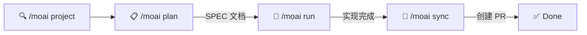
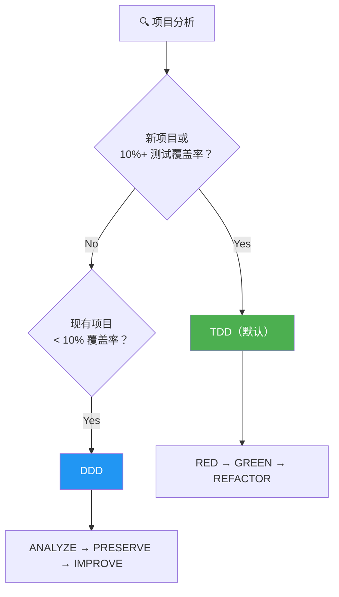
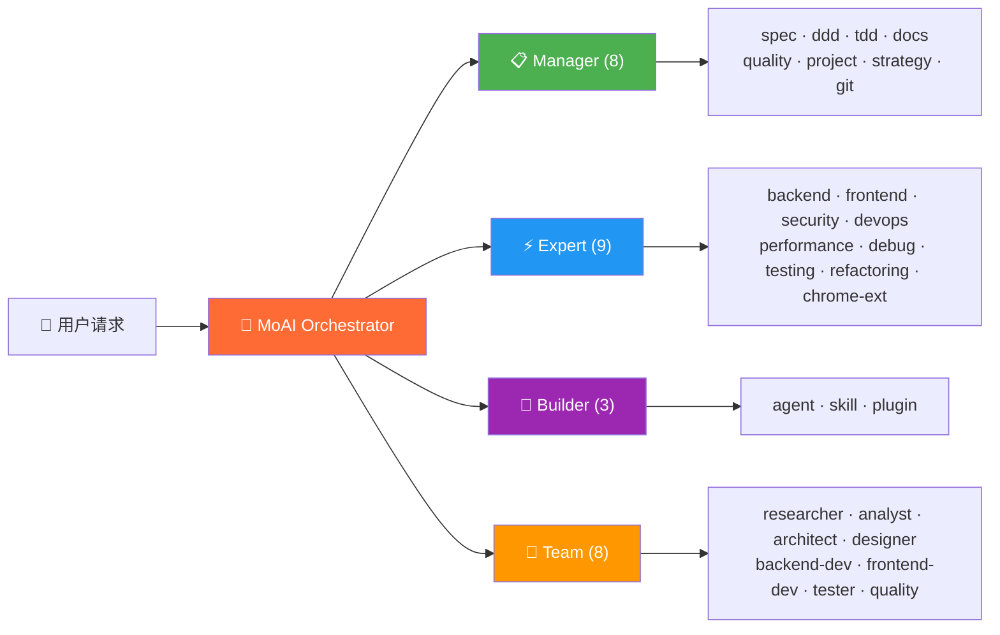
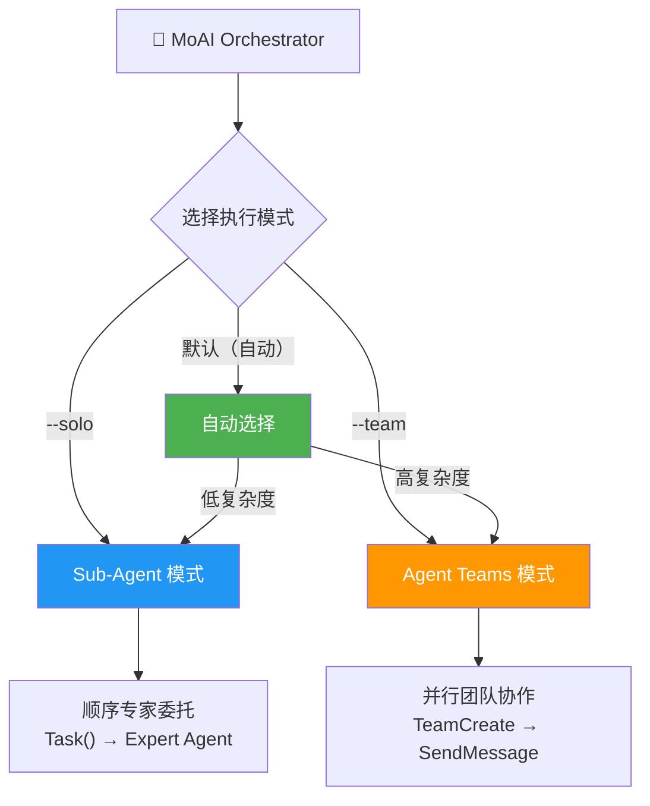
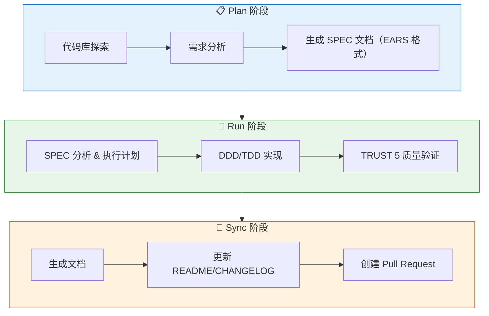

<p align="center">
  
</p>

<h1 align="center">MoAI-ADK</h1>

<p align="center">
  <strong>Claude Code 的 Agentic Development Kit</strong>
</p>

<p align="center">
  <a href="./README.md">English</a> ·
  <a href="./README.ko.md">한국어</a> ·
  <a href="./README.ja.md">日本語</a> ·
  <a href="./README.zh.md">中文</a>
</p>

<p align="center">
  <a href="https://github.com/modu-ai/moai-adk/actions/workflows/ci.yml"></a>
  <a href="https://github.com/modu-ai/moai-adk/actions/workflows/codeql.yml"></a>
  <a href="https://codecov.io/gh/modu-ai/moai-adk"></a>
  <br>
  <a href="https://go.dev/"></a>
  <a href="https://github.com/modu-ai/moai-adk/releases"></a>
  <a href="./LICENSE"></a>
</p>

<p align="center">
  <a href="https://adk.mo.ai.kr"><strong>官方文档</strong></a>
</p>

---

> 📚 **[官方文档](https://adk.mo.ai.kr)** | **[GitHub Discussions](https://github.com/modu-ai/moai-adk/discussions)** | **[Discord 社区](https://discord.gg/moai-adk)**

---

> **"氛围编程的目的不是追求速度，而是代码质量。"**

MoAI-ADK 是专为 Claude Code 打造的**高性能 AI 开发环境**。28 个专业 AI 智能体与 52 个技能协同工作，助力产出高质量代码。新项目和功能开发默认采用 TDD，覆盖率低于 10% 的现有项目自动采用 DDD，并支持 Sub-Agent 与 Agent Teams 双执行模式。

使用 Go 编写的单一可执行文件 -- 零依赖，全平台即刻运行。

---

## 为什么选择 MoAI-ADK？

我们将基于 Python 的 MoAI-ADK（约 73,000 行）用 Go 完全重写。

| 项目 | Python 版 | Go 版 |
|------|-----------|-------|
| 部署 | pip + venv + 依赖管理 | **单一可执行文件**，零依赖 |
| 启动时间 | ~800ms 解释器启动 | **~5ms** 原生执行 |
| 并发性 | asyncio / threading | **原生 goroutines** |
| 类型安全 | 运行时（mypy 可选） | **编译时强制** |
| 跨平台 | 需要 Python 运行时 | **预构建二进制**（macOS、Linux、Windows） |
| 钩子执行 | Shell 包装器 + Python | **编译后的二进制**，JSON 协议 |

### 核心数据

- **34,220 行** Go 代码，**32 个**包
- **85-100%** 测试覆盖率
- **28 个**专业 AI 智能体 + **52 个**技能
- **18 种**编程语言支持
- **16 个** Claude Code 钩子事件

---

## 系统要求

| 平台 | 支持环境 | 备注 |
|------|---------|------|
| macOS | Terminal, iTerm2 | 完全支持 |
| Linux | Bash, Zsh | 完全支持 |
| Windows | **WSL（推荐）**, PowerShell 7.x+ | 原生 cmd.exe 不支持 |

**前置条件：**
- 所有平台必须安装 **Git**
- **Windows 用户**：必须安装 [Git for Windows](https://gitforwindows.org/)（包含 Git Bash）
  - 推荐使用 **WSL**（适用于 Linux 的 Windows 子系统）
  - 也支持 PowerShell 7.x 及以上版本
  - 旧版 Windows PowerShell 5.x 和 cmd.exe **不受支持**

---

## 快速入门

### 1. 安装

#### macOS / Linux / WSL

```bash
curl -fsSL https://raw.githubusercontent.com/modu-ai/moai-adk/main/install.sh | bash
```

#### Windows（PowerShell 7.x+）

> **推荐**：为获得最佳体验，请在 WSL 中使用上面的 Linux 安装命令。

```powershell
irm https://raw.githubusercontent.com/modu-ai/moai-adk/main/install.ps1 | iex
```

> 需要先安装 [Git for Windows](https://gitforwindows.org/)。

#### 从源码构建（Go 1.26+）

```bash
git clone https://github.com/modu-ai/moai-adk.git
cd moai-adk && make build
```

> 预构建二进制可在 [Releases](https://github.com/modu-ai/moai-adk/releases) 页面下载。

### 2. 初始化项目

```bash
moai init my-project
```

交互式向导将自动检测语言、框架和方法论，并生成 Claude Code 集成文件。

### 3. 在 Claude Code 中开始开发

```bash
# 启动 Claude Code 后
/moai project                            # 生成项目文档（product.md, structure.md, tech.md）
/moai plan "添加用户认证功能"              # 生成 SPEC 文档
/moai run SPEC-AUTH-001                   # DDD/TDD 实现
/moai sync SPEC-AUTH-001                  # 文档同步 & 创建 PR
```



---

## MoAI 开发方法论

MoAI-ADK 根据项目状态自动选择最优的开发方法论。



### TDD 方法论（默认）

新项目和功能开发推荐的默认方法论。先写测试，再实现代码。

| 阶段 | 说明 |
|------|------|
| **RED** | 编写定义期望行为的失败测试 |
| **GREEN** | 编写使测试通过的最小代码 |
| **REFACTOR** | 在保持测试绿色的同时提升代码质量 |

对于棕地项目（现有代码库），TDD 增加了 **RED 前分析步骤**：在编写测试前先阅读现有代码，了解当前行为。

### DDD 方法论（覆盖率 < 10% 的现有项目）

专为测试覆盖率较低的现有项目安全重构而设计的方法论。

```
ANALYZE   → 分析现有代码和依赖关系，识别领域边界
PRESERVE  → 编写特征测试，捕获当前行为快照
IMPROVE   → 在测试保护下渐进改进
```

> 方法论在 `moai init` 时自动选定（`--mode <ddd|tdd>`，默认: tdd），可在 `.moai/config/sections/quality.yaml` 的 `development_mode` 中修改。
>
> **注意**：MoAI-ADK v2.5.0+ 采用二元方法论选择（仅 TDD 或 DDD）。混合模式已移除，以确保清晰性和一致性。

---

## AI 智能体编排

MoAI 是一个**战略编排器**。它不直接编写代码，而是将任务委托给 28 个专业智能体。



### 智能体分类

| 分类 | 数量 | 智能体 | 职责 |
|------|------|--------|------|
| **Manager** | 8 | spec, ddd, tdd, docs, quality, project, strategy, git | 工作流编排、SPEC 生成、质量管理 |
| **Expert** | 9 | backend, frontend, security, devops, performance, debug, testing, refactoring, chrome-extension | 领域专业实现、分析、优化 |
| **Builder** | 3 | agent, skill, plugin | 创建新的 MoAI 组件 |
| **Team** | 8 | researcher, analyst, architect, designer, backend-dev, frontend-dev, tester, quality | 并行团队协作开发 |

### 52 个技能（渐进式披露）

为优化 Token 效率，采用三级渐进式披露系统管理：

| 分类 | 技能数 | 示例 |
|------|--------|------|
| **Foundation** | 5 | core, claude, philosopher, quality, context |
| **Workflow** | 11 | spec, project, ddd, tdd, testing, worktree, thinking... |
| **Domain** | 5 | backend, frontend, database, uiux, data-formats |
| **Language** | 18 | Go, Python, TypeScript, Rust, Java, Kotlin, Swift, C++... |
| **Platform** | 9 | Vercel, Supabase, Firebase, Auth0, Clerk, Railway... |
| **Library** | 3 | shadcn, nextra, mermaid |
| **Tool** | 2 | ast-grep, svg |
| **Specialist** | 11 | Figma, Flutter, Chrome Extension, Pencil... |

---

## 模型策略（Token 优化）

MoAI-ADK 根据您的 Claude Code 订阅方案，为 28 个智能体分配最优 AI 模型。在方案的速率限制内最大化质量。

| 策略 | 方案 | 🟣 Opus | 🔵 Sonnet | 🟡 Haiku | 适用场景 |
|------|------|------|--------|-------|----------|
| **High** | Max $200/月 | 23 | 1 | 4 | 最高质量，最大吞吐量 |
| **Medium** | Max $100/月 | 4 | 19 | 5 | 质量与成本平衡 |
| **Low** | Plus $20/月 | 0 | 12 | 16 | 经济实惠，无 Opus |

> **为什么重要？** Plus $20 方案不包含 Opus。设置为 `Low` 后，所有智能体仅使用 Sonnet 和 Haiku，避免速率限制错误。更高级方案可在关键智能体（安全、策略、架构）上使用 Opus，常规任务使用 Sonnet/Haiku。

### 各档位智能体模型分配

#### Manager Agents

| 智能体 | High | Medium | Low |
|--------|------|--------|-----|
| manager-spec | 🟣 opus | 🟣 opus | 🔵 sonnet |
| manager-strategy | 🟣 opus | 🟣 opus | 🔵 sonnet |
| manager-ddd | 🟣 opus | 🔵 sonnet | 🔵 sonnet |
| manager-tdd | 🟣 opus | 🔵 sonnet | 🔵 sonnet |
| manager-project | 🟣 opus | 🔵 sonnet | 🟡 haiku |
| manager-docs | 🔵 sonnet | 🟡 haiku | 🟡 haiku |
| manager-quality | 🟡 haiku | 🟡 haiku | 🟡 haiku |
| manager-git | 🟡 haiku | 🟡 haiku | 🟡 haiku |

#### Expert Agents

| 智能体 | High | Medium | Low |
|--------|------|--------|-----|
| expert-backend | 🟣 opus | 🔵 sonnet | 🔵 sonnet |
| expert-frontend | 🟣 opus | 🔵 sonnet | 🔵 sonnet |
| expert-security | 🟣 opus | 🟣 opus | 🔵 sonnet |
| expert-debug | 🟣 opus | 🔵 sonnet | 🔵 sonnet |
| expert-refactoring | 🟣 opus | 🔵 sonnet | 🔵 sonnet |
| expert-devops | 🟣 opus | 🔵 sonnet | 🟡 haiku |
| expert-performance | 🟣 opus | 🔵 sonnet | 🟡 haiku |
| expert-testing | 🟣 opus | 🔵 sonnet | 🟡 haiku |
| expert-chrome-extension | 🟣 opus | 🔵 sonnet | 🟡 haiku |

#### Builder Agents

| 智能体 | High | Medium | Low |
|--------|------|--------|-----|
| builder-agent | 🟣 opus | 🔵 sonnet | 🟡 haiku |
| builder-skill | 🟣 opus | 🔵 sonnet | 🟡 haiku |
| builder-plugin | 🟣 opus | 🔵 sonnet | 🟡 haiku |

#### Team Agents

| 智能体 | High | Medium | Low |
|--------|------|--------|-----|
| team-architect | 🟣 opus | 🟣 opus | 🔵 sonnet |
| team-analyst | 🟣 opus | 🔵 sonnet | 🟡 haiku |
| team-designer | 🟣 opus | 🔵 sonnet | 🟡 haiku |
| team-backend-dev | 🟣 opus | 🔵 sonnet | 🔵 sonnet |
| team-frontend-dev | 🟣 opus | 🔵 sonnet | 🔵 sonnet |
| team-tester | 🟣 opus | 🔵 sonnet | 🟡 haiku |
| team-researcher | 🟡 haiku | 🟡 haiku | 🟡 haiku |
| team-quality | 🟡 haiku | 🟡 haiku | 🟡 haiku |

### 配置方法

```bash
# 项目初始化时
moai init my-project          # 交互式向导中选择模型策略

# 重新配置现有项目
moai update                   # 交互式提示每个配置步骤
```

在 `moai update` 期间，您会被询问：
- **重置模型策略？** (y/n) - 重新运行模型策略配置向导
- **更新 GLM 设置？** (y/n) - 在 settings.local.json 中配置 GLM 环境变量

> 默认策略为 `High`。GLM 设置隔离在 `settings.local.json`（不提交到 Git）。

---

## 双执行模式

MoAI-ADK 同时提供 Claude Code 支持的 **Sub-Agent** 和 **Agent Teams** 两种执行模式。



### Agent Teams 模式（默认）

MoAI-ADK 自动分析项目复杂度并选择最优执行模式：

| 条件 | 选择模式 | 原因 |
|------|----------|------|
| 3+ 个领域 | Agent Teams | 多领域协调 |
| 10+ 个受影响文件 | Agent Teams | 大规模变更 |
| 复杂度评分 7+ | Agent Teams | 高度复杂 |
| 其他 | Sub-Agent | 简单、可预测的工作流 |

**Agent Teams 模式**采用并行团队开发：

- 多个智能体同时工作，通过共享任务列表协作
- 通过 `TeamCreate`、`SendMessage` 和 `TaskList` 实现实时协调
- 最适合大规模功能开发和多领域任务

```bash
/moai plan "大型功能"          # 自动：researcher + analyst + architect 并行
/moai run SPEC-XXX             # 自动：backend-dev + frontend-dev + tester 并行
/moai run SPEC-XXX --team      # 强制 Agent Teams 模式
```

**Agent Teams 质量钩子：**
- **TeammateIdle Hook**：在智能体空闲前验证 LSP 质量门禁（错误、类型错误、Lint 错误）
- **TaskCompleted Hook**：验证任务引用 SPEC-XXX 模式时 SPEC 文档存在
- 所有验证使用优雅降级 - 警告已记录但工作继续

### Sub-Agent 模式（`--solo`）

利用 Claude Code 的 `Task()` API 实现顺序智能体委托方式。

- 将任务委托给一个专业智能体并获取结果
- 按步骤依次执行 Manager → Expert → Quality
- 适用于简单且可预测的工作流

```bash
/moai run SPEC-AUTH-001 --solo    # 强制 Sub-Agent 模式
```

---

## MoAI 工作流

### Plan → Run → Sync 流水线

MoAI 的核心工作流由三个阶段组成：



### /moai 子命令

所有子命令在 Claude Code 中以 `/moai <subcommand>` 方式调用。

#### 核心工作流

| 子命令 | 别名 | 目的 | 关键标志 |
|--------|------|------|----------|
| `plan` | `spec` | 创建 SPEC 文档（EARS 格式） | `--worktree`, `--branch`, `--resume SPEC-XXX`, `--team` |
| `run` | `impl` | SPEC 的 DDD/TDD 实现 | `--resume SPEC-XXX`, `--team` |
| `sync` | `docs`, `pr` | 文档同步、代码地图和创建 PR | `--merge`, `--skip-mx` |

#### 质量与测试

| 子命令 | 别名 | 目的 | 关键标志 |
|--------|------|------|----------|
| `fix` | — | 自动修复 LSP 错误、Lint、类型错误（单次执行） | `--dry`, `--seq`, `--level N`, `--resume`, `--team` |
| `loop` | — | 迭代自动修复直至完成（最多 100 次） | `--max N`, `--auto-fix`, `--seq` |
| `review` | `code-review` | 代码审查与安全和 @MX 标签合规检查 | `--staged`, `--branch`, `--security` |
| `coverage` | `test-coverage` | 测试覆盖率分析和缺口补充（16 种语言） | `--target N`, `--file PATH`, `--report` |
| `e2e` | — | E2E 测试（Claude-in-Chrome、Playwright CLI 或 Agent Browser） | `--record`, `--url URL`, `--journey NAME` |
| `clean` | `refactor-clean` | 死代码识别和安全移除 | `--dry`, `--safe-only`, `--file PATH` |

#### 文档与代码库

| 子命令 | 别名 | 目的 | 关键标志 |
|--------|------|------|----------|
| `project` | `init` | 生成项目文档（product.md、structure.md、tech.md、.moai/project/codemaps/） | — |
| `mx` | — | 扫描代码库并添加 @MX 代码级注解 | `--all`, `--dry`, `--priority P1-P4`, `--force`, `--team` |
| `codemaps` | `update-codemaps` | 在 `.moai/project/codemaps/` 中生成架构文档 | `--force`, `--area AREA` |
| `feedback` | `fb`, `bug`, `issue` | 收集用户反馈并创建 GitHub issues | — |

#### 默认工作流

| 子命令 | 目的 | 关键标志 |
|--------|------|----------|
| *(无)* | 完整自主 plan → run → sync 流水线。复杂度评分 >= 5 时自动生成 SPEC。 | `--loop`, `--max N`, `--branch`, `--pr`, `--resume SPEC-XXX`, `--team`, `--solo` |

### 执行模式标志

控制工作流执行期间智能体的调度方式：

| 标志 | 模式 | 说明 |
|------|------|------|
| `--team` | Agent Teams | 并行团队执行。多个智能体同时工作。 |
| `--solo` | Sub-Agent | 顺序单智能体委托（每阶段）。 |
| *(默认)* | 自动 | 系统根据复杂度自动选择（域 >= 3、文件 >= 10 或评分 >= 7）。 |

**`--team` 支持三种执行环境：**

| 环境 | 命令 | 领导者 | 工作者 | 最适合 |
|------|------|--------|--------|--------|
| 仅 Claude | `moai cc` | Claude | Claude | 最高质量 |
| 仅 GLM | `moai glm` | GLM | GLM | 最大成本节省 |
| CG（Claude+GLM） | `moai cg` | Claude | GLM | 质量+成本平衡 |

> **注意**：`moai cg` 使用 tmux pane 级别环境隔离来分离 Claude 领导者和 GLM 工作者。如果从 `moai glm` 切换，`moai cg` 会自动先重置 GLM 设置 -- 无需在中间运行 `moai cc`。

### 自主开发循环（Ralph Engine）

一个结合 LSP 诊断和 AST-grep 的自主错误修复引擎：

```bash
/moai fix       # 单次执行：扫描 → 分类 → 修复 → 验证
/moai loop      # 循环修复：重复执行直到检测到完成标记（最多 100 次）
```

**Ralph Engine 工作流程：**
1. **并行扫描**：同时运行 LSP 诊断 + AST-grep + Linters
2. **自动分类**：将错误分为 Level 1（自动修复）至 Level 4（需用户介入）
3. **收敛检测**：相同错误重复出现时启用备选策略
4. **完成条件**：0 错误、0 类型错误、85%+ 覆盖率

### 推荐工作流链

**新功能开发：**
```
/moai plan → /moai run SPEC-XXX → /moai review → /moai coverage → /moai sync SPEC-XXX
```

**Bug 修复：**
```
/moai fix (或 /moai loop) → /moai review → /moai sync
```

**重构：**
```
/moai plan → /moai clean → /moai run SPEC-XXX → /moai review → /moai coverage → /moai codemaps
```

**文档更新：**
```
/moai codemaps → /moai sync
```

---

## TRUST 5 质量框架

所有代码变更均通过五项质量标准验证：

| 标准 | 说明 | 验证项 |
|------|------|--------|
| **T**ested | 已测试 | 85%+ 覆盖率、特征测试、单元测试通过 |
| **R**eadable | 可读性 | 清晰的命名规范、一致的代码风格、0 Lint 错误 |
| **U**nified | 统一性 | 一致的格式化、导入顺序、遵循项目结构 |
| **S**ecured | 安全性 | OWASP 合规、输入验证、0 安全警告 |
| **T**rackable | 可追溯 | 约定式提交、Issue 引用、结构化日志 |

---

## 任务指标日志

MoAI-ADK 在开发会话期间自动捕获任务工具指标：

- **位置**：`.moai/logs/task-metrics.jsonl`
- **捕获指标**：Token 使用、工具调用、持续时间、智能体类型
- **目的**：会话分析、性能优化、成本跟踪

当 Task 工具完成时，指标由 PostToolUse 钩子记录。使用此数据分析智能体效率和优化 Token 消耗。

---

## CLI 命令

| 命令 | 说明 |
|------|------|
| `moai init` | 交互式项目设置（自动检测语言/框架/方法论） |
| `moai doctor` | 系统状态诊断与环境验证 |
| `moai status` | 项目状态概览：Git 分支、质量指标等 |
| `moai update` | 更新到最新版本（支持自动回滚） |
| `moai update --check` | 仅检查更新，不安装 |
| `moai update --project` | 仅同步项目模板 |
| `moai worktree new <name>` | 创建新 Git worktree（并行分支开发） |
| `moai worktree list` | 列出活跃的 worktree |
| `moai worktree switch <name>` | 切换 worktree |
| `moai worktree sync` | 与上游同步 |
| `moai worktree remove <name>` | 移除 worktree |
| `moai worktree clean` | 清理过期 worktree |
| `moai worktree go <name>` | 在当前 Shell 中导航到 worktree 目录 |
| `moai hook <event>` | Claude Code 钩子分发器 |
| `moai glm` | 使用 GLM 5 API 启动 Claude Code（经济高效的替代方案） |
| `moai cc` | 不使用 GLM 设置启动 Claude Code（仅 Claude 模式） |
| `moai cg` | 启用 CG 模式 — Claude 领导者 + GLM 工作者（tmux pane 级别隔离） |
| `moai version` | 版本、提交哈希、构建日期信息 |

---

## CG 模式（Claude + GLM 混合）

CG 模式是一种混合模式，领导者使用 **Claude API**，工作者使用 **GLM API**。通过 tmux 会话级环境变量隔离实现。

### 工作原理

```
moai cg 执行
    │
    ├── 1. 向 tmux 会话环境变量注入 GLM 配置
    │      (ANTHROPIC_AUTH_TOKEN, BASE_URL, MODEL_* 变量)
    │
    ├── 2. 从 settings.local.json 移除 GLM 环境变量
    │      → 领导者窗格使用 Claude API
    │
    └── 3. 设置 CLAUDE_CODE_TEAMMATE_DISPLAY=tmux
           → 工作者在新窗格中继承 GLM 环境变量

┌─────────────────────────────────────────────────────────────┐
│  LEADER（当前 tmux 窗格，Claude API）                        │
│  - 执行 /moai --team 时协调工作流                            │
│  - 处理 plan、quality、sync 阶段                             │
│  - 无 GLM 环境变量 → 使用 Claude API                         │
└──────────────────────┬──────────────────────────────────────┘
                       │ Agent Teams（新 tmux 窗格）
                       ▼
┌─────────────────────────────────────────────────────────────┐
│  TEAMMATES（新 tmux 窗格，GLM API）                          │
│  - 继承 tmux 会话环境变量 → 使用 GLM API                     │
│  - 执行 run 阶段的实现任务                                   │
│  - 通过 SendMessage 与领导者通信                             │
└─────────────────────────────────────────────────────────────┘
```

### 使用方法

```bash
# 1. 保存 GLM API 密钥（首次）
moai glm sk-your-glm-api-key

# 2. 确认 tmux 环境（已在使用 tmux 则跳过）
# 如果需要新的 tmux 会话:
tmux new -s moai

# 提示：将 VS Code 终端默认设置为 tmux，
# 可自动在 tmux 环境中启动，跳过此步骤。

# 3. 启用 CG 模式
moai cg

# 4. 在同一窗格启动 Claude Code（重要！）
claude

# 5. 运行团队工作流
/moai --team "任务描述"
```

### 注意事项

| 项目 | 说明 |
|------|------|
| **tmux 环境** | 如果已在使用 tmux，无需创建新会话。将 VS Code 终端默认设置为 tmux 会更方便。 |
| **领导者启动位置** | 必须在执行 `moai cg` 的 **同一窗格** 启动 Claude Code。在新窗格启动会继承 GLM 环境变量。 |
| **会话结束时** | session_end 钩子自动清除 tmux 会话环境变量 → 下个会话恢复使用 Claude |
| **Agent Teams 通信** | 使用 SendMessage 工具可实现领导者↔工作者间通信 |

### 模式对比

| 命令 | 领导者 | 工作者 | 需要 tmux | 成本节省 | 使用场景 |
|------|--------|--------|-----------|----------|----------|
| `moai cc` | Claude | Claude | 否 | - | 复杂工作、最高质量 |
| `moai glm` | GLM | GLM | 推荐 | ~70% | 成本优化 |
| `moai cg` | Claude | GLM | **必需** | **~60%** | 质量与成本平衡 |

### 显示模式

Agent Teams 支持两种显示模式:

| 模式 | 说明 | 通信 | 领导者/工作者分离 |
|------|------|------|------------------|
| `in-process` | 默认模式，所有终端 | ✅ SendMessage | ❌ 相同环境变量 |
| `tmux` | 分割窗格显示 | ✅ SendMessage | ✅ 会话环境变量隔离 |

**CG 模式仅在 `tmux` 显示模式下支持领导者/工作者 API 分离。**

---

## 架构

```
moai-adk/
├── cmd/moai/             # 应用程序入口
├── internal/             # 核心私有包
│   ├── astgrep/          # AST-grep 集成
│   ├── cli/              # Cobra CLI 命令定义
│   ├── config/           # 线程安全 YAML 配置管理
│   ├── core/
│   │   ├── git/          # Git 操作（分支、worktree、冲突检测）
│   │   ├── project/      # 项目初始化、语言/框架检测
│   │   └── quality/      # TRUST 5 质量门禁、并行验证器
│   ├── defs/             # 语言定义和框架检测
│   ├── git/              # Git 约定验证引擎
│   ├── hook/             # 编译后的钩子系统（16 个事件、JSON 协议）
│   ├── loop/             # Ralph 反馈循环（状态机、收敛检测）
│   ├── lsp/              # LSP 客户端（16+ 种语言、并行服务器管理）
│   ├── manifest/         # 文件来源追踪（SHA-256 完整性）
│   ├── merge/            # 三路合并引擎（6 种策略）
│   ├── rank/             # MoAI Rank 同步和记录管理
│   ├── resilience/       # 重试策略和熔断器
│   ├── shell/            # Shell 集成（worktree 导航）
│   ├── statusline/       # Claude Code 状态栏集成
│   ├── template/         # 模板部署（go:embed）、配置生成
│   ├── ui/               # 交互式 TUI（选择器、复选框、向导）
│   └── update/           # 二进制自更新机制
├── pkg/                  # 公共库包
│   ├── models/           # 共享数据模型
│   └── version/          # 构建版本元数据
└── Makefile              # 构建自动化
```

### 主要包覆盖率

| 包 | 用途 | 覆盖率 |
|----|------|--------|
| `foundation` | EARS 模式、TRUST 5、18 种语言定义 | 98.4% |
| `core/quality` | 并行验证器、阶段门禁 | 96.8% |
| `ui` | 交互式 TUI 组件 | 96.8% |
| `config` | 线程安全 YAML 配置 | 94.1% |
| `loop` | Ralph 反馈循环、收敛检测 | 92.7% |
| `cli` | Cobra 命令 | 92.0% |
| `ralph` | 收敛决策引擎 | 100% |
| `statusline` | Claude Code 状态栏 | 100% |

---

## 赞助商

### z.ai GLM 5

MoAI-ADK 通过与 **z.ai GLM 5** 的合作伙伴关系，提供经济高效的 AI 开发环境。

| 优势 | 说明 |
|------|------|
| 节省 70% 成本 | 仅为 Claude 1/7 的价格，性能相当 |
| 完全兼容 | 无需修改代码即可与 Claude Code 配合使用 |
| 无限使用 | 无每日/每周 Token 限制，自由使用 |

**[注册 GLM 5（额外 10% 折扣）](https://z.ai/subscribe?ic=1NDV03BGWU)** -- 注册奖励将用于 MoAI 开源开发。

---

## @MX 标签系统

MoAI-ADK 使用 **@MX 代码级注解系统**在 AI 智能体之间传递上下文、不变量和危险区域。

### 什么是 @MX 标签？

@MX 标签是内联代码注解，帮助 AI 智能体更快、更准确地理解您的代码库。

```go
// @MX:ANCHOR: [AUTO] 钩子注册分发 - 5+ 个调用者
// @MX:REASON: [AUTO] 所有钩子事件的中央入口点，变更影响范围广
func DispatchHook(event string, data []byte) error {
    // ...
}

// @MX:WARN: [AUTO] Goroutine 执行时没有 context.Context
// @MX:REASON: [AUTO] 无法取消 goroutine，潜在资源泄漏
func processAsync() {
    go func() {
        // ...
    }()
}
```

### 标签类型

| 标签类型 | 用途 | 说明 |
|---------|------|------|
| `@MX:ANCHOR` | 重要合约 | fan_in >= 3 的函数，变更影响范围广 |
| `@MX:WARN` | 危险区域 | Goroutines、复杂度 >= 15、全局状态变更 |
| `@MX:NOTE` | 上下文 | 魔法常数、缺少 godoc、业务规则 |
| `@MX:TODO` | 未完成工作 | 缺少测试、未实现的功能 |

### 为什么不是每个代码都有 @MX 标签？

@MX 标签系统**不设计用于给所有代码添加标签**。核心原则是**"仅标记 AI 需要首先注意的最危险/最重要的代码。"**

| 优先级 | 条件 | 标签类型 |
|--------|------|----------|
| **P1（关键）** | fan_in >= 3 | `@MX:ANCHOR` |
| **P2（危险）** | goroutine、复杂度 >= 15 | `@MX:WARN` |
| **P3（上下文）** | 魔法常数、无 godoc | `@MX:NOTE` |
| **P4（缺失）** | 无测试文件 | `@MX:TODO` |

**大多数代码不符合任何条件，因此没有标签。** 这是**正常的**。

### 示例：标签决策

```go
// ❌ 无标签（fan_in = 1、低复杂度）
func calculateTotal(items []Item) int {
    total := 0
    for _, item := range items {
        total += item.Price
    }
    return total
}

// ✅ 添加了 @MX:ANCHOR（fan_in = 5）
// @MX:ANCHOR: [AUTO] 配置管理器加载 - 5+ 个调用者
// @MX:REASON: [AUTO] 所有 CLI 命令的入口点
func LoadConfig() (*Config, error) {
    // ...
}
```

### 配置（`.moai/config/sections/mx.yaml`）

```yaml
thresholds:
  fan_in_anchor: 3        # < 3 个调用者 = 无 ANCHOR
  complexity_warn: 15     # < 15 复杂度 = 无 WARN
  branch_warn: 8          # < 8 个分支 = 无 WARN

limits:
  anchor_per_file: 3      # 每个文件最多 3 个 ANCHOR 标签
  warn_per_file: 5        # 每个文件最多 5 个 WARN 标签

exclude:
  - "**/*_generated.go"   # 排除生成的文件
  - "**/vendor/**"        # 排除外部库
  - "**/mock_*.go"        # 排除 mock 文件
```

### 运行 MX 标签扫描

```bash
# 扫描整个代码库（Go 项目）
/moai mx --all

# 仅预览（不修改文件）
/moai mx --dry

# 按优先级扫描（仅 P1）
/moai mx --priority P1

# 仅扫描特定语言
/moai mx --all --lang go,python
```

### 为什么其他项目也有很少的 MX 标签

| 情况 | 原因 |
|------|------|
| **新项目** | 大多数函数 fan_in = 0 → 无标签（正常） |
| **小项目** | 函数少 = 简单的调用图 = 标签少 |
| **高质量代码** | 低复杂度、无 goroutines → 无 WARN 标签 |
| **高阈值** | `fan_in_anchor: 5` = 更少的标签 |

### 核心原则

@MX 标签系统优化**"信噪比"**：

- ✅ **仅标记真正重要的代码** → AI 快速识别核心区域
- ❌ **标记所有代码** → 增加噪音，重要标签更难找到

---

## 常见问题

### Q: 为什么不是所有 Go 代码都有 @MX 标签？

**A: 这是正常的。** @MX 标签是"按需添加的"。大多数代码足够简单安全，不需要标签。

| 问题 | 答案 |
|------|------|
| 没有标签是问题吗？ | **不是。** 大多数代码不需要标签。 |
| 何时添加标签？ | **仅高 fan_in、复杂逻辑、危险模式** |
| 所有项目都类似吗？ | **是的。** 每个项目中的大多数代码都没有标签。 |

详见上方的 **"@MX 标签系统"** 部分。

---

### Q: 如何自定义显示的状态栏段？

状态栏支持 4 个显示预设加上自定义配置：

- **Full**（默认）：显示所有 8 个段
- **Compact**：仅显示 Model + Context + Git Status + Branch
- **Minimal**：仅显示 Model + Context
- **Custom**：选择个别段

在 `moai init` / `moai update` 向导中配置（对"重置状态栏"回答"y"），或编辑 `.moai/config/sections/statusline.yaml`：

```yaml
statusline:
  preset: compact  # 或 full、minimal、custom
  segments:
    model: true
    context: true
    output_style: false
    directory: false
    git_status: true
    claude_version: false
    moai_version: false
    git_branch: true
```

详见 [SPEC-STATUSLINE-001](.moai/specs/SPEC-STATUSLINE-001/spec.md)。

---

### Q: 状态栏中的版本指示符是什么意思？

MoAI 状态栏显示带有更新通知的版本信息：

```
🗿 v2.2.2 ⬆️ v2.2.5
```

- **`v2.2.2`**：当前安装的版本
- **`⬆️ v2.2.5`**：新版本可用于更新

当您在最新版本上时，只显示版本号：
```
🗿 v2.2.5
```

**更新方法**：运行 `moai update`，更新通知将消失。

**注意**：这与 Claude Code 的内置版本指示符（`🔅 v2.1.38`）不同。MoAI 指示符跟踪 MoAI-ADK 版本，Claude Code 单独显示其自身版本。

---

### Q: 出现"允许外部 CLAUDE.md 文件导入？"警告

打开项目时，Claude Code 可能显示关于外部文件导入的安全提示：

```
External imports:
  /Users/<user>/.moai/config/sections/quality.yaml
  /Users/<user>/.moai/config/sections/user.yaml
  /Users/<user>/.moai/config/sections/language.yaml
```

**推荐操作**：选择 **"No, disable external imports"** ✅

**为什么？**
- 您的项目的 `.moai/config/sections/` 已包含这些文件
- 项目特定设置优先于全局设置
- 基本配置已嵌入 CLAUDE.md 文本
- 禁用外部导入更安全且不影响功能

**这些文件是什么？**
- `quality.yaml`：TRUST 5 框架和开发方法论设置
- `language.yaml`：语言偏好（对话、注释、提交）
- `user.yaml`：用户名（可选，用于 Co-Authored-By 属性）

---

## 贡献

欢迎贡献！详细指南请参阅 [CONTRIBUTING.md](CONTRIBUTING.md)。

### 快速入门

1. Fork 本仓库
2. 创建功能分支：`git checkout -b feature/my-feature`
3. 编写测试（新代码用 TDD，现有代码用特征测试）
4. 确认所有测试通过：`make test`
5. 确认 Lint 通过：`make lint`
6. 格式化代码：`make fmt`
7. 使用约定式提交信息提交
8. 提交 Pull Request

**代码质量要求**：85%+ 覆盖率 · 0 Lint 错误 · 0 类型错误 · 约定式提交

### 社区

- [GitHub Discussions](https://github.com/modu-ai/moai-adk/discussions) -- 提问、想法、反馈
- [Discord 社区](https://discord.gg/moai-adk) -- 实时交流、技巧分享
- [Issues](https://github.com/modu-ai/moai-adk/issues) -- Bug 报告、功能请求

---

## Star History

[](https://www.star-history.com/#modu-ai/moai-adk&type=date&legend=top-left)

---

## 许可证

[Copyleft 3.0](./LICENSE) -- 详情请参阅 LICENSE 文件。

## 相关链接

- [官方文档](https://adk.mo.ai.kr)
- [Claude Code](https://docs.anthropic.com/en/docs/claude-code)
- [GitHub Discussions](https://github.com/modu-ai/moai-adk/discussions) -- 提问、想法、社区
- [Discord 社区](https://discord.gg/moai-adk) -- 实时交流、技巧分享
